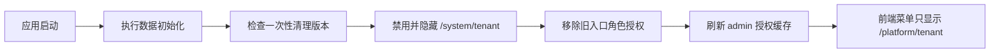

# 旧租户管理入口清理需求

## 背景

租户管理已经落到 `平台管理 / 租户管理`，对应前端页面 `/platform/tenant` 和后端接口 `/platform/tenant/*`。

历史版本中还存在一个 `系统管理 / 租户管理` 入口，路径为 `/system/tenant`。该入口是早期占位页面，没有完整业务功能。如果旧数据库里保留了它的角色菜单授权，用户会点到无功能页面，误以为租户管理不可用。

## 目标

- 菜单只保留真实可用的 `平台管理 / 租户管理`。
- 自动清理旧数据库中残留的 `系统管理 / 租户管理` 授权。
- 不重复恢复用户已经手动取消的菜单权限。
- 清理后管理员刷新菜单，不再看到旧入口。

## 非目标

- 不删除平台租户管理功能。
- 不改变租户套餐、租户数据隔离、租户管理员初始化逻辑。
- 不移除菜单表中的历史记录，只禁用隐藏旧入口，便于追溯。

## 数据流

