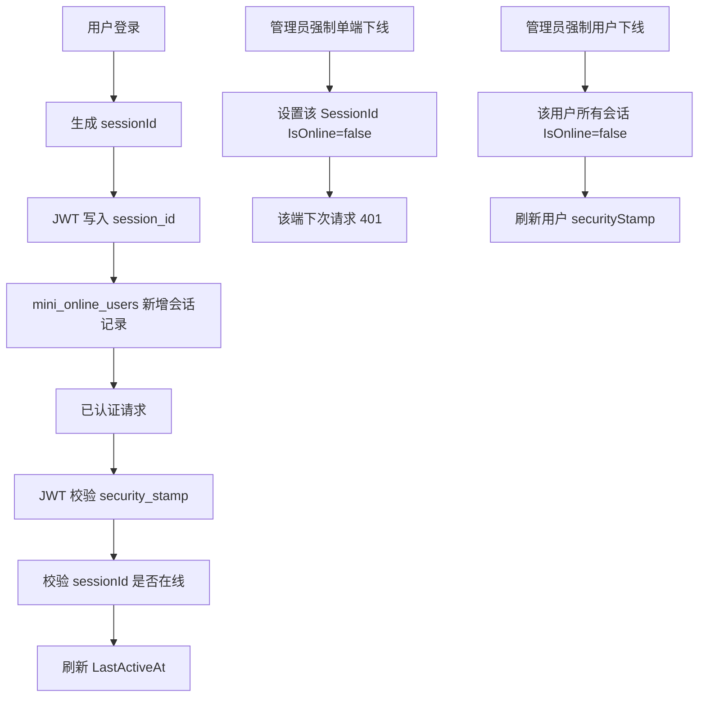

# 多端会话管理需求文档

## 背景

当前在线用户能力以用户为粒度记录在线状态，同一个账号多端登录时会互相覆盖 IP、浏览器和最近活跃时间。企业级后台需要能区分不同设备或浏览器会话，并支持只踢掉某一端。

## 目标

- 登录后为每个 token 生成独立会话 ID。
- 在线用户列表按会话展示，而不是按用户聚合。
- 支持强制下线单个会话。
- 保留强制下线整个用户的能力。
- token 校验时检查会话是否仍在线，单端下线后该 token 立即失效。
- 同一账号在同一浏览器重新登录时，自动替换该浏览器旧会话，避免在线列表出现不可再使用的重复会话。

## 范围

- 后端 JWT 增加 `session_id` claim。
- `mini_online_users` 增加会话维度字段，并改为以 `SessionId` 作为主键。
- 登录成功记录一个新的在线会话。
- 每次已认证请求刷新对应会话的最近活跃时间。
- 在线列表返回 `sessionId`、`deviceName`、`browserName` 等会话信息。
- 新增接口 `POST /system/online-user/session/{sessionId}/force-logout`。
- 现有接口 `POST /system/online-user/{userId}/force-logout` 继续保留，表示踢掉该用户所有会话。

## 非目标

- 本阶段不做“限制同账号最大同时在线数”，后续可以接安全策略配置。
- 本阶段不做精确设备指纹，只基于 User-Agent 做轻量浏览器/设备展示。
- 本阶段不做移动端推送提醒。

## 数据流

## 验收标准

- 同一用户在不同浏览器登录，在线列表出现两条不同 `sessionId` 的记录。
- 同一用户在同一浏览器重复登录，在线列表只保留最新 `sessionId`。
- 强制下线其中一个 session 后，该 session 的 token 访问受保护接口返回 401，另一个 session 仍可访问。
- 强制下线用户后，该用户全部 session token 都失效。
- 在线列表展示账号、姓名、IP、设备、浏览器、登录时间、最近活跃时间。
- 后端测试通过，前端构建通过。
