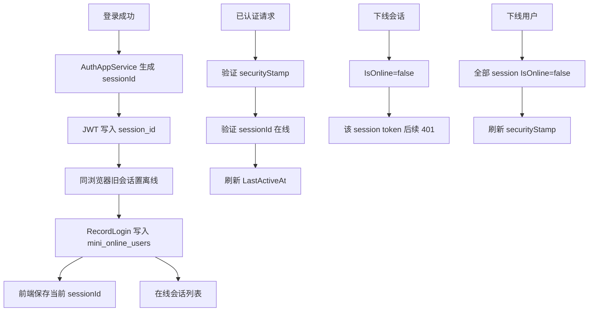

# 多端会话管理总结文档

## 完成内容

- 登录时生成独立 `sessionId`，并写入 JWT 的 `session_id` claim。
- 登录成功后按 session 新增在线记录，同一账号多端登录会生成多条在线会话。
- JWT 校验时同时校验：
  - 用户 `securityStamp` 是否有效。
  - 当前 `sessionId` 是否仍在线且未超时。
- 在线用户列表升级为在线会话列表，返回：
  - `sessionId`
  - `userId`
  - 账号、姓名、IP
  - 设备、浏览器、User-Agent
  - 登录时间、最近活跃时间
- 新增单端强制下线接口：
  - `POST /system/online-user/session/{sessionId}/force-logout`
- 保留整用户强制下线接口：
  - `POST /system/online-user/{userId}/force-logout`
- 整用户强制下线仍会刷新用户 `securityStamp`，让该用户所有 token 失效。
- 单端强制下线只设置当前 session 离线，不影响同用户其他 session token。
- 同一账号在同一 IP、同一 User-Agent 重新登录时，会自动把旧会话置为离线，只保留最新会话。
- 前端登录后保存当前 `sessionId`，在线用户页执行“下线会话”时按 `sessionId` 判断是否为当前会话，避免踢 Edge 会话时误把当前 Chrome 退出。

## 数据流

## 关键文件

- `src/MiniAdmin.Domain/Entities/OnlineUser.cs`
- `src/MiniAdmin.Application.Contracts/Auth/ITokenService.cs`
- `src/MiniAdmin.Application.Contracts/Auth/LoginResult.cs`
- `src/MiniAdmin.Infrastructure/Auth/JwtTokenService.cs`
- `src/MiniAdmin.Application/Auth/AuthAppService.cs`
- `src/MiniAdmin.Infrastructure/Persistence/EfOnlineUserRepository.cs`
- `src/MiniAdmin.Infrastructure/Persistence/MiniAdminDbContext.cs`
- `src/MiniAdmin.Infrastructure/Persistence/MiniAdminDatabaseInitializer.cs`
- `src/MiniAdmin.Api/Program.cs`
- `frontend/vue-vben-admin/apps/web-antd/src/views/system/online-user/index.vue`
- `frontend/vue-vben-admin/apps/web-antd/src/api/system/online-user.ts`
- `frontend/vue-vben-admin/apps/web-antd/src/store/auth.ts`

## 验证结果

- `dotnet test C:\monica\code\mini-admin\MiniAdmin.slnx`
  - 通过：100
  - 失败：0
- `pnpm run build:antd`
  - 退出码：0
  - Vben web-antd 构建完成

## 后续建议

下一步可以把“是否允许多端同时在线、最大同时在线会话数”接入安全策略配置。这样管理员可以控制同账号是否允许多设备在线，以及登录新设备时是否自动挤掉最旧会话。
