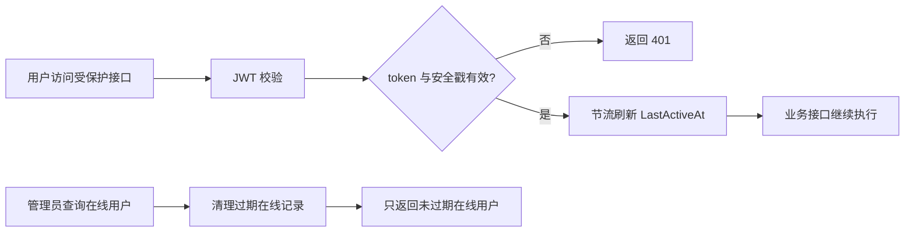

# 在线用户活跃状态清理需求文档

## 背景与目标

在线用户列表用于管理员判断当前系统访问情况。原实现只在登录成功时标记在线，在主动退出或强制下线时标记离线；如果用户直接关闭浏览器、token 过期、开发测试反复登录但没有退出，旧记录会长期停留在在线列表中。

本次目标是让在线用户状态具备活跃生命周期：只有最近活跃的用户才显示为在线，过期记录自动转为离线，系统监控看板的在线人数也使用同一口径。

## 功能范围

- 在线用户列表过滤过期活跃记录。
- 查询在线用户前自动把过期记录标记为离线。
- 已登录用户访问受保护接口时刷新最近活跃时间。
- 系统监控看板在线人数按活跃时间统计。
- 提供可配置的活跃超时时间和刷新节流时间。

## 不做范围

- 不新增独立会话表。
- 不实现多端会话明细。
- 不改动 token 策略和前端登录流程。
- 不手动删除历史在线用户记录。

## 权限与安全要求

- 在线用户列表仍要求 `system:online-user:query`。
- 强制下线仍要求 `system:online-user:force-logout`。
- 强制下线和主动退出仍会更新用户安全戳，让旧 token 失效。
- 活跃时间刷新只在 token 校验通过后执行。

## 接口或页面要求

- `/system/online-user/list` 不再返回超过活跃超时时间的记录。
- `/system/monitor/overview` 的在线人数与在线用户列表保持一致。
- 前端页面无需改造，仍使用原接口。

## 数据存储要求

- 复用 `mini_online_users.LastActiveAt` 和 `mini_online_users.IsOnline`。
- 不新增表和字段。
- 默认配置：
  - `OnlineUsers:ActiveTimeoutMinutes = 30`
  - `OnlineUsers:TouchThrottleSeconds = 60`

## 数据流转

## 验收标准

- [ ] 过期在线记录不会出现在在线用户列表。
- [ ] 查询在线用户时，过期记录会被标记为离线。
- [ ] 系统监控看板在线人数不统计过期记录。
- [ ] 后端测试通过。
- [ ] 完成后启动后端和前端供验证。
