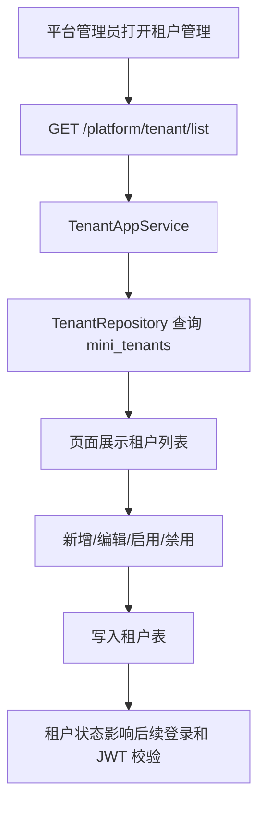

# 平台租户管理需求文档

## 背景

SaaS 租户底座已经具备租户实体、租户状态、租户编码登录、JWT 租户信息和禁用租户后 token 失效能力。下一步需要提供平台管理员可视化维护租户的入口，让平台方可以查询、新增、编辑、启用和禁用租户。

## 目标

- 新增平台租户管理菜单。
- 平台管理员可以查看租户列表。
- 平台管理员可以新增租户。
- 平台管理员可以编辑租户基础信息。
- 平台管理员可以启用或禁用租户。
- 禁用租户后，该租户用户不能登录，已有 token 后续请求失效。
- 前端页面符合当前 MiniAdmin / Vben 风格。

## 范围

- 后端新增平台租户管理接口。
- 后端新增租户应用服务和仓储方法。
- 前端新增平台租户管理 API 和页面。
- 菜单种子增加“平台管理 / 租户管理”。
- 管理员角色默认拥有租户管理权限。

## 非目标

- 本阶段不做平台代入租户。
- 本阶段不做初始化租户管理员。
- 本阶段不做套餐管理页面。
- 本阶段不做租户独立数据库。
- 本阶段不做套餐计费。

## 权限

| 权限码 | 说明 |
| --- | --- |
| `platform:tenant:query` | 查询租户 |
| `platform:tenant:create` | 新增租户 |
| `platform:tenant:update` | 编辑租户 |
| `platform:tenant:enable` | 启用租户 |
| `platform:tenant:disable` | 禁用租户 |

## 数据流

## 验收标准

- 管理员可以在菜单中看到“平台管理 / 租户管理”。
- 租户列表可以展示默认 `demo` 租户。
- 可以新增租户，编码不能重复。
- 可以编辑租户名称、联系人、状态、过期时间和备注。
- 可以禁用租户。
- 禁用 `demo` 租户后，`demo` 用户不能登录，旧 token 访问接口返回 401。
- 后端测试通过，前端构建通过。
