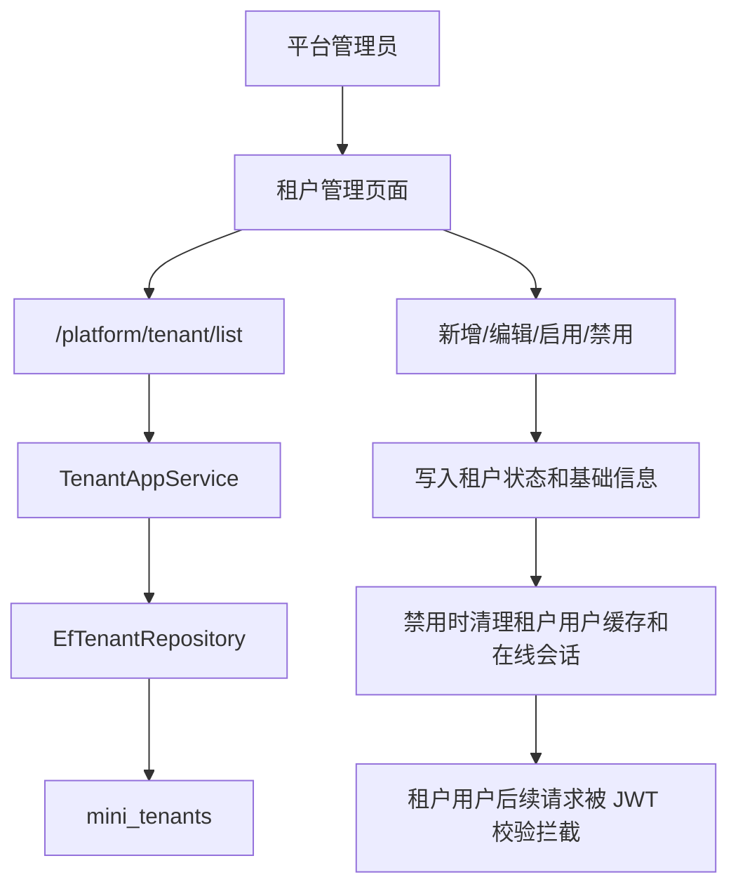

# 平台租户管理功能总结

## 本次完成

- 新增平台租户管理后端接口：
  - `GET /platform/tenant/list`
  - `POST /platform/tenant`
  - `PUT /platform/tenant/{id}`
  - `POST /platform/tenant/{id}/enable`
  - `POST /platform/tenant/{id}/disable`
- 新增租户管理应用服务 `TenantAppService`。
- 扩展 `ITenantRepository` 和 EF 实现，支持租户列表、新增、编辑、启用、禁用。
- 新增平台菜单种子：
  - 平台管理
  - 租户管理
  - 查询、新增、编辑、启用、禁用权限
- 新增 Vben 前端页面：
  - 租户编码、租户名称、状态筛选
  - 租户列表
  - 新增租户
  - 编辑租户基础信息
  - 启用和停用租户

## 关键业务规则

- 平台管理员不属于任何租户，后续负责维护租户、套餐和租户生命周期。
- 租户用户必须携带租户编码登录。
- 禁用租户后，该租户下用户不能继续登录。
- 禁用租户时同步让该租户用户的旧 token 和在线会话失效，避免停用后仍可访问。
- 老数据库升级时，即使基础种子版本已执行，也会在启动时幂等补齐默认套餐、`demo` 租户和 `demo` 用户的租户归属。
- Redis 缓存不可用或超时时，缓存层会自动使用本机内存兜底，避免登录、权限缓存和租户管理被 Redis 抖动拖挂。
- 当前阶段只做平台维护入口，不做平台代入租户，也不做租户管理员初始化。

## 数据流

## 验证记录

- `dotnet test C:\monica\code\mini-admin\tests\MiniAdmin.Tests\MiniAdmin.Tests.csproj --filter "PlatformTenant"`：2 个测试通过。
- `dotnet test C:\monica\code\mini-admin\tests\MiniAdmin.Tests\MiniAdmin.Tests.csproj --filter "DatabaseInitializer_Restores_Default_Tenant|ResilientDistributedCache|PlatformTenant"`：4 个相关测试通过。
- `dotnet test C:\monica\code\mini-admin\MiniAdmin.slnx`：108 个测试通过。
- `pnpm run build:antd`：前端构建通过。
- `http://localhost:5320/health`：后端健康检查返回 `Healthy`。
- `http://localhost:5666/`：前端开发服务返回 200。
- 实测 `GET /platform/tenant/list?page=1&pageSize=10` 返回 `demo / 演示租户 / Active`。

## 下一步建议

- 租户管理员初始化：创建租户时可选择是否同步创建租户管理员账号。
- 租户套餐管理：限制菜单、用户数、存储空间、功能模块。
- 租户上下文隔离：逐步给业务表增加 `TenantId` 并做查询过滤。
- 平台代入租户：平台管理员可临时进入租户视角排查问题，但必须写审计日志。
