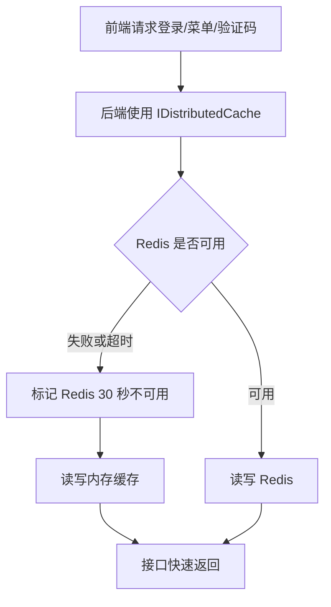

# Redis 快速兜底修复总结

## 本次问题

页面一直转圈，但后端 `/health` 正常、前端首页也正常。这说明不是服务未启动，而是前端依赖的登录态、权限码或菜单接口响应过慢。

进一步验证后发现，登录后的完整链路会超时。结合当前环境使用线上 Redis，根因是 Redis 不稳定时，每个缓存操作都会先等待 Redis 超时，再落到内存缓存，导致页面长时间等待。

## 本次修复

- Redis 配置自动补充短超时参数：
  - `abortConnect=False`
  - `connectRetry=1`
  - `connectTimeout=1000`
  - `syncTimeout=1000`
  - `asyncTimeout=1000`
- `ResilientDistributedCache` 增加 30 秒短期熔断：
  - Redis 第一次失败后记录不可用窗口。
  - 不可用窗口内直接使用内存缓存。
  - 30 秒后自动尝试恢复 Redis。

## 数据流

## 验证结果

- 缓存专项测试通过：2 个测试。
- 后端完整测试通过：111 个测试。
- 后端构建通过：0 个错误。
- 后端服务已启动并返回 `Healthy`。
- 前端服务已启动并返回 200。
- 登录主链路已不再超时。
