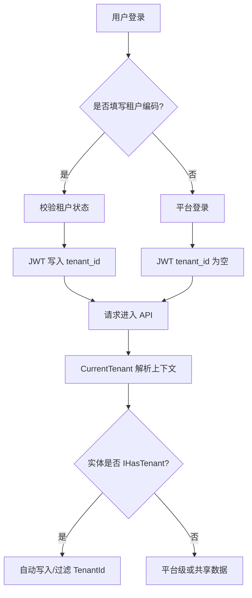

# SaaS 租户底座需求文档

## 背景

MiniAdmin 已经具备后台管理系统的基础能力，包括 RBAC、菜单权限、部门岗位、字典参数、文件、日志、通知、监控、安全中心和多端会话。下一阶段要面向企业级 SaaS 场景，需要把系统从“单组织后台”升级为“平台运营方管理多个租户，每个租户拥有独立后台和业务数据”的模式。

租户能力不能只是在业务表上增加 `TenantId`。它需要同时覆盖登录识别、用户角色隔离、数据过滤、套餐授权、平台代入租户、审计追踪和后续代码生成器的租户感知。

## 目标

- 支持 SaaS 多租户模式，一个平台管理多个租户。
- 采用共享数据库、共享表、`TenantId` 隔离的第一版方案。
- 区分平台用户和租户用户，平台用户 `TenantId` 为空，租户用户归属指定租户。
- 登录时识别租户，JWT 写入租户信息。
- 请求期间提供 `CurrentTenant` 当前租户上下文。
- 租户级数据自动写入和过滤 `TenantId`，降低接口手写过滤遗漏风险。
- 平台管理员可以管理租户，并在排查问题时代入某个租户上下文。
- 预留租户套餐、功能授权、用户数限制、存储限制和代码生成器租户感知能力。

## 租户模式

第一版采用：

```text
共享 MySQL 数据库
共享业务表
TenantId 字段隔离租户数据
```

选择原因：

- 与当前项目结构和 MySQL 持久化最匹配。
- 部署简单，适合学习重建和早期企业级后台落地。
- 方便统一迁移、统一定时任务、统一审计日志。
- 后续可以扩展为大客户独立库或混合模式。

本阶段不采用“每个租户独立数据库”，但接口和领域模型设计要避免把未来扩展堵死。

## 核心概念

### 平台端

平台端属于系统运营方，用于管理所有租户。

建议菜单：

```text
平台管理
- 租户管理
- 租户套餐
- 租户功能授权
```

平台用户特征：

- `TenantId = null`
- 可管理租户、套餐、全局系统配置。
- 默认不混入任何租户用户列表。
- 需要排查问题时，可以显式代入某个租户。

### 租户端

租户端属于客户自己的后台。

租户用户特征：

- `TenantId = 当前租户Id`
- 只能访问本租户的数据。
- 使用本租户内的角色、部门、岗位、字典、参数和业务模块。
- 租户被禁用或过期后，不能继续登录，已有会话也需要失效或受限。

## 数据模型要求

### 租户表

建议实体：`Tenant`

字段建议：

| 字段 | 说明 |
| --- | --- |
| `Id` | 租户 ID |
| `Name` | 租户名称 |
| `Code` | 租户编码，登录时可使用 |
| `Status` | 状态：待初始化、正常、禁用、过期 |
| `PackageId` | 套餐 ID，可为空 |
| `ContactName` | 联系人 |
| `ContactPhone` | 联系电话 |
| `ContactEmail` | 联系邮箱 |
| `ExpireAt` | 到期时间，可为空 |
| `Remark` | 备注 |
| `CreatedAt` | 创建时间 |
| `UpdatedAt` | 更新时间 |

### 租户套餐表

第一版可以先建基础能力，复杂计费不做。

建议实体：`TenantPackage`

字段建议：

| 字段 | 说明 |
| --- | --- |
| `Id` | 套餐 ID |
| `Name` | 套餐名称 |
| `MaxUsers` | 最大用户数 |
| `MaxStorageMb` | 最大存储空间 |
| `MenuIds` | 可用菜单或功能集合，第一版可用 JSON |
| `IsEnabled` | 是否启用 |
| `Remark` | 备注 |

### 租户隔离实体

租户级实体应实现统一接口，例如：

```csharp
public interface IHasTenant
{
    Guid? TenantId { get; set; }
}
```

第一批需要纳入租户隔离的核心表：

- 用户
- 角色
- 用户角色关系
- 部门
- 岗位
- 字典类型和字典项
- 参数配置
- 文件记录
- 通知公告接收范围
- 业务模块表

平台级表原则上不带租户或允许 `TenantId = null`：

- 租户
- 租户套餐
- 平台全局菜单模板
- 平台系统配置
- 平台监控数据

## 登录与租户识别

第一版登录页增加租户编码：

```text
租户编码：demo
账号：admin
密码：******
```

登录规则：

- 平台管理员登录可以不填租户编码。
- 租户用户登录必须填写租户编码。
- 后端根据租户编码找到租户，并校验租户状态。
- 租户禁用、过期、待初始化时拒绝普通登录。
- 登录成功后 JWT 写入租户信息。

JWT 建议包含：

```text
user_id
user_name
tenant_id
tenant_code
security_stamp
session_id
```

## 当前租户上下文

后端需要提供 `CurrentTenant`：

```text
TenantId
TenantCode
IsPlatform
IsTenant
```

来源优先级建议：

1. 平台管理员代入租户时的显式上下文。
2. JWT 中的 `tenant_id`。
3. 无租户上下文时视为平台上下文。

平台用户代入租户时，需要记录审计日志，避免平台操作不可追踪。

## 数据隔离要求

租户数据隔离必须尽量自动化。

要求：

- 新增租户级实体时自动写入当前 `TenantId`。
- 查询租户级实体时自动过滤当前 `TenantId`。
- 租户用户不能查询、修改、删除其他租户数据。
- 平台管理员默认看平台数据，只有显式代入或平台查询接口才可跨租户。
- 批量操作、导入导出、文件下载、定时任务也必须遵守租户边界。

数据隔离数据流：



## 平台代入租户

平台管理员需要支持“进入租户后台”能力。

建议规则：

- 平台管理员在租户列表点击“代入租户”。
- 后端发放带目标 `tenant_id` 的代入上下文，或者前端在请求头传递代入租户 ID。
- 所有代入操作都要写操作日志，记录平台用户、目标租户、请求路径、请求体和操作结果。
- 页面顶部需要明确显示当前正在代入的租户，避免误操作。
- 平台管理员可以退出代入，回到平台上下文。

## 租户状态要求

租户状态建议：

| 状态 | 说明 |
| --- | --- |
| `Pending` | 待初始化，租户管理员未创建或初始化未完成 |
| `Active` | 正常 |
| `Disabled` | 禁用 |
| `Expired` | 已过期 |

状态影响：

- `Active`：允许登录和访问。
- `Pending`：只允许平台初始化，不允许租户普通登录。
- `Disabled`：拒绝登录，已有会话应失效。
- `Expired`：拒绝新登录，已有会话可以按策略失效。

## 权限与安全要求

平台权限建议：

| 权限码 | 说明 |
| --- | --- |
| `platform:tenant:query` | 查询租户 |
| `platform:tenant:create` | 新增租户 |
| `platform:tenant:update` | 编辑租户 |
| `platform:tenant:delete` | 删除租户，第一版可不开放 |
| `platform:tenant:enable` | 启用租户 |
| `platform:tenant:disable` | 禁用租户 |
| `platform:tenant:impersonate` | 代入租户 |
| `platform:tenant-package:query` | 查询套餐 |
| `platform:tenant-package:update` | 维护套餐 |

安全要求：

- 租户管理员不能访问平台管理菜单。
- 平台管理员不能被租户角色授权。
- 租户用户不能被分配平台角色。
- 禁用租户时需要清理或失效该租户在线会话。
- 所有租户管理和代入操作必须写审计日志。

## 与代码生成器的关系

后续代码生成器必须支持租户感知配置：

```text
是否租户隔离
租户字段 TenantId
是否平台级模块
是否部门数据权限
是否生成审计日志
是否生成菜单权限
是否生成导入导出
```

生成规则：

- 业务模块默认租户隔离。
- 平台管理模块默认平台级。
- 生成的 Repository 或查询服务必须接入租户过滤。
- 生成的新增接口必须自动写入 `TenantId`。
- 生成的前端页面不暴露 `TenantId` 输入框，除非是平台级租户筛选页面。

## 非目标

- 本阶段不做每租户独立数据库。
- 本阶段不做支付、订单、计费流水。
- 本阶段不做复杂套餐升级审批。
- 本阶段不一次性改造所有业务模块页面细节，优先完成底座和核心系统表隔离。
- 本阶段不实现代码生成器，只预留租户感知设计。

## 验收标准

- 平台管理员可以不带租户登录。
- 租户管理员必须通过租户编码登录。
- 登录成功 JWT 包含正确租户信息。
- 租户被禁用或过期时，租户用户不能继续登录。
- 租户用户只能看到本租户用户、角色、部门、岗位、字典、参数等数据。
- 平台管理员可以管理租户。
- 平台管理员可以代入指定租户，并能退出代入。
- 代入租户的操作有审计日志。
- 禁用租户后，该租户在线会话失效或被强制下线。
- 后续代码生成器可以基于本设计生成租户隔离模块。
