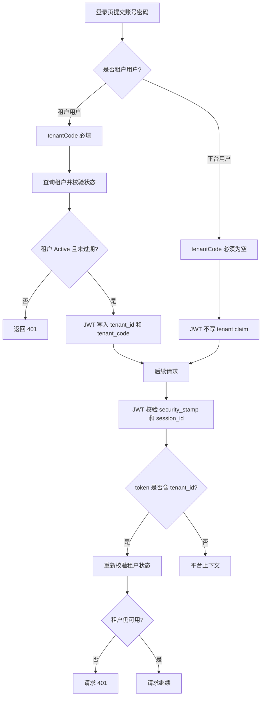

# SaaS 租户底座总结文档

## 完成内容

- 新增租户实体 `Tenant` 和租户套餐实体 `TenantPackage`。
- 新增租户状态枚举 `TenantStatus`，支持 `Pending`、`Active`、`Disabled`、`Expired`。
- 新增租户隔离契约 `IHasTenant` 和当前租户契约 `ICurrentTenant`。
- 用户实体增加 `TenantId`，平台用户 `TenantId = null`，租户用户绑定具体租户。
- 初始化默认租户：
  - 租户编码：`demo`
  - 租户名称：`演示租户`
  - 状态：`Active`
- 初始化默认套餐：`默认套餐`。
- 将内置 `demo` 用户归属到 `demo` 租户。
- 登录接口支持 `tenantCode`。
- 租户用户必须填写租户编码，平台用户不填写租户编码。
- 登录成功后 JWT 写入：
  - `tenant_id`
  - `tenant_code`
- 登录结果返回：
  - `tenantId`
  - `tenantCode`
- JWT 校验阶段会重新检查租户状态，租户禁用或过期后，旧 token 不能继续访问接口。
- 前端登录页增加“租户编码”输入。
- 前端登录账号快捷选择调整为 `Admin` 和 `Demo`，选择 `Demo` 时自动填入租户编码 `demo`。
- MySQL 初始化脚本补齐：
  - `mini_tenants`
  - `mini_tenant_packages`
  - `mini_users.TenantId`

## 数据流

## 关键文件

- `src/MiniAdmin.Domain/Entities/Tenant.cs`
- `src/MiniAdmin.Domain/Entities/TenantPackage.cs`
- `src/MiniAdmin.Domain/Entities/User.cs`
- `src/MiniAdmin.Domain.Shared/MultiTenancy/TenantStatus.cs`
- `src/MiniAdmin.Domain.Shared/MultiTenancy/IHasTenant.cs`
- `src/MiniAdmin.Application.Contracts/MultiTenancy/*`
- `src/MiniAdmin.Application.Contracts/Auth/LoginRequest.cs`
- `src/MiniAdmin.Application.Contracts/Auth/LoginResult.cs`
- `src/MiniAdmin.Application.Contracts/Auth/AuthenticatedUserDto.cs`
- `src/MiniAdmin.Application/Auth/AuthAppService.cs`
- `src/MiniAdmin.Infrastructure/Auth/JwtTokenService.cs`
- `src/MiniAdmin.Infrastructure/Persistence/EfTenantRepository.cs`
- `src/MiniAdmin.Infrastructure/Persistence/EfAuthRepository.cs`
- `src/MiniAdmin.Infrastructure/Persistence/MiniAdminDbContext.cs`
- `src/MiniAdmin.Infrastructure/Persistence/MiniAdminDatabaseInitializer.cs`
- `src/MiniAdmin.Api/Program.cs`
- `frontend/vue-vben-admin/apps/web-antd/src/api/core/auth.ts`
- `frontend/vue-vben-admin/apps/web-antd/src/views/_core/authentication/login.vue`
- `tests/MiniAdmin.Tests/VbenLoginLoopTests.cs`

## 验证结果

- `dotnet test C:\monica\code\mini-admin\MiniAdmin.slnx`
  - 通过：104
  - 失败：0
- `pnpm run build:antd`
  - 退出码：0
  - Vben web-antd 构建完成

## 当前使用方式

- 平台管理员登录：
  - 租户编码留空
  - 账号：`admin`
  - 密码：`123456`
- 演示租户用户登录：
  - 租户编码：`demo`
  - 账号：`demo`
  - 密码：`123456`

## 后续建议

下一阶段建议做“平台租户管理”：

- 平台管理菜单。
- 租户列表。
- 新增、编辑、启用、禁用租户。
- 初始化租户管理员。
- 平台管理员代入租户。
- 顶部显示当前代入租户。

完成平台租户管理后，再继续改造角色、部门、字典、参数、文件等资源的租户级自动过滤。
