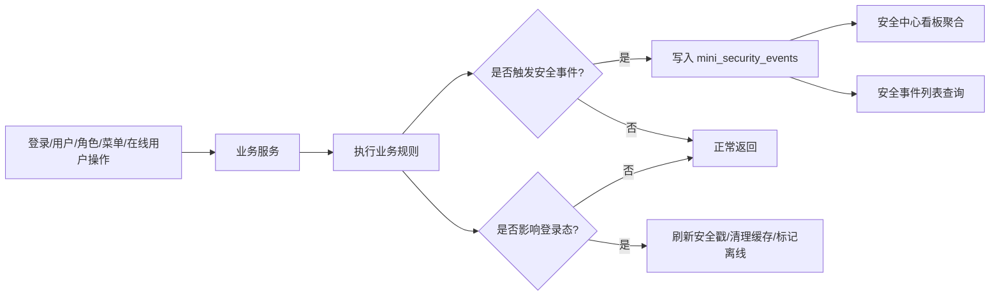

# 安全中心需求文档

## 背景与目标

当前系统已经具备 RBAC 权限、数据权限、登录安全、在线用户、审计日志、告警与通知能力。下一步需要把这些分散能力聚合成一个企业级后台常见的“安全中心”，让管理员可以集中查看账号风险、会话风险和高风险操作，并逐步配置安全策略。

第一阶段目标不是做复杂风控平台，而是先建立安全治理闭环：

- 让管理员知道系统当前有哪些安全风险。
- 让关键账号保护规则可执行。
- 让登录失败、锁定账号、权限变更、强制下线等安全事件能集中查看。
- 为后续更细粒度策略、通知和自动处置打基础。

## 功能范围

### 安全中心看板

- 展示账号安全概览：
  - 用户总数
  - 启用用户数
  - 锁定用户数
  - 长期未登录用户数
- 展示登录安全概览：
  - 近 24 小时登录失败次数
  - 近 24 小时失败用户数
  - 近 24 小时失败 IP 数
- 展示权限安全概览：
  - 近 24 小时角色/菜单/用户权限相关变更次数
  - 最近高风险操作列表
- 展示会话安全概览：
  - 当前在线用户数
  - 最近强制下线记录

### 安全策略

第一阶段支持以下策略配置和执行：

- 禁止删除最后一个管理员。
- 禁止禁用最后一个管理员。
- 角色或权限变更后，受影响用户的 token 失效。
- 用户被禁用后，立即强制下线。
- 长期未登录用户识别，默认阈值 90 天。

### 安全事件

安全事件用于把关键安全行为统一成可查询记录。第一阶段事件来源：

- 登录失败
- 账号锁定
- 账号解锁
- 用户禁用
- 强制下线
- 角色授权变更
- 用户角色变更
- 菜单权限变更

## 不做范围

- 不做多端会话明细表。
- 不做设备指纹。
- 不做复杂风控评分。
- 不做短信、企业微信、钉钉等通知通道。
- 不做自动封禁 IP。
- 不做密码复杂度策略编辑页；先保留当前登录安全规则。

## 权限与安全要求

新增权限建议：

- `system:security-center:query`：查看安全中心看板。
- `system:security-event:query`：查看安全事件列表。
- `system:security-policy:query`：查看安全策略。
- `system:security-policy:update`：更新安全策略。

默认只有 `admin` 角色拥有以上权限。

后端必须强制校验安全策略，不能只依赖前端按钮隐藏：

- 删除用户时校验是否最后一个管理员。
- 禁用用户时校验是否最后一个管理员。
- 角色授权变更后刷新受影响用户授权缓存和安全戳。
- 用户禁用后刷新该用户安全戳并标记离线。

## 页面要求

菜单位置：

- `系统监控 / 安全中心`

页面结构建议：

- 顶部概览指标：账号风险、登录风险、权限风险、会话风险。
- 中间安全事件趋势或最近事件。
- 下方分栏：
  - 高风险操作
  - 锁定账号
  - 长期未登录账号
  - 最近强制下线

第一阶段可先做一个页面，不拆多个子菜单。

## 接口要求

建议接口：

- `GET /system/security-center/overview`
- `GET /system/security-event/list`
- `GET /system/security-policy`
- `PUT /system/security-policy`

第一阶段可以先实现看板和事件列表，策略配置页可以先读默认配置，再逐步支持编辑。

## 数据存储要求

新增安全事件表：

- `mini_security_events`

建议字段：

- `Id`
- `EventType`
- `Level`
- `UserId`
- `UserName`
- `IpAddress`
- `UserAgent`
- `Title`
- `Description`
- `RelatedEntityType`
- `RelatedEntityId`
- `CreatedAt`

安全策略第一阶段可以先使用配置项，不急着落库；后续需要页面编辑时再落库到系统参数或独立策略表。

## 数据流转

## 验收标准

- [ ] 管理员可以打开安全中心页面。
- [ ] 看板能展示账号、登录、权限、会话四类安全概览。
- [ ] 安全事件列表能查看登录失败、强制下线、权限变更等事件。
- [ ] 删除最后一个管理员会被后端拒绝。
- [ ] 禁用最后一个管理员会被后端拒绝。
- [ ] 用户禁用后旧 token 失效。
- [ ] 角色/权限变更后受影响用户旧 token 失效。
- [ ] 完成后启动后端和前端供验证。
