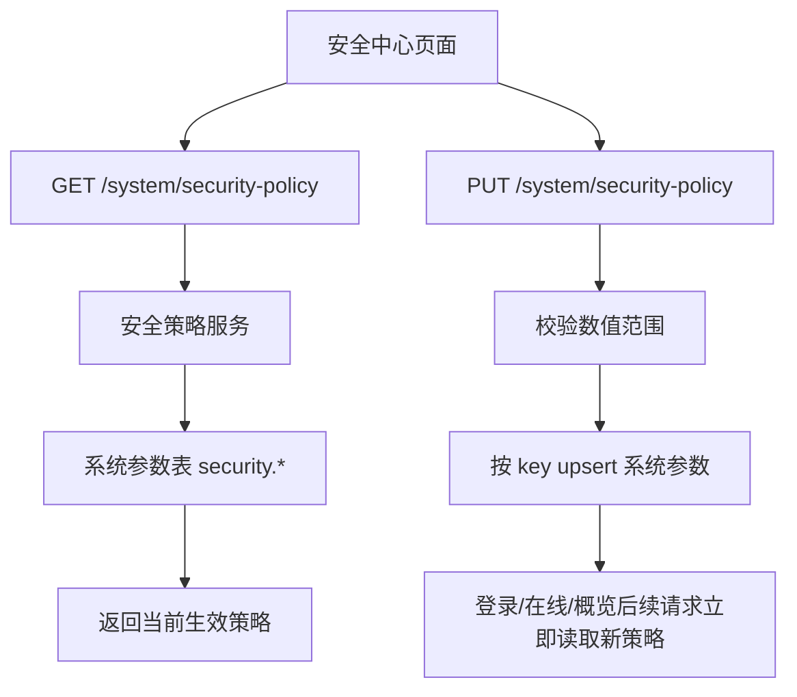

# 安全策略配置总结文档

## 完成内容

- 新增安全策略接口：
  - `GET /system/security-policy`
  - `PUT /system/security-policy`
- 新增安全策略 DTO、更新请求、应用服务和仓储实现。
- 策略值保存到系统参数表，参数分组为 `security`。
- 策略读取顺序为：启用的系统参数优先；参数缺失或无效时使用配置默认值。
- 登录安全服务已经改为读取运行时策略：
  - 验证码触发失败次数
  - 账号锁定失败次数
  - 账号锁定时长
  - 验证码有效期
- 在线用户和安全中心概览已经改为读取运行时策略：
  - 在线活跃分钟数
  - 在线心跳写入间隔秒数
  - 长期未登录天数
- 安全中心页面右侧增加“安全策略”配置区，保存后刷新概览数据。

## 数据流

## 关键文件

- `src/MiniAdmin.Application.Contracts/Security/SecurityDtos.cs`
- `src/MiniAdmin.Application/Security/SecurityPolicyAppService.cs`
- `src/MiniAdmin.Infrastructure/Persistence/EfSecurityPolicyRepository.cs`
- `src/MiniAdmin.Infrastructure/Auth/DistributedLoginSecurityService.cs`
- `src/MiniAdmin.Infrastructure/Persistence/EfOnlineUserRepository.cs`
- `src/MiniAdmin.Infrastructure/Persistence/EfSecurityEventRepository.cs`
- `frontend/vue-vben-admin/apps/web-antd/src/views/system/security-center/index.vue`
- `frontend/vue-vben-admin/apps/web-antd/src/api/system/security-center.ts`

## 验证结果

- `dotnet test C:\monica\code\mini-admin\MiniAdmin.slnx`
  - 通过：98
  - 失败：0
- `pnpm run build:antd`
  - 退出码：0
  - Vben web-antd 构建完成

## 下一步建议

下一阶段可以做“多端会话管理”，把当前按用户聚合的在线状态升级为按 token/设备/浏览器维度管理，支持查看登录设备、单独踢某一端、限制同账号同时在线数量。
