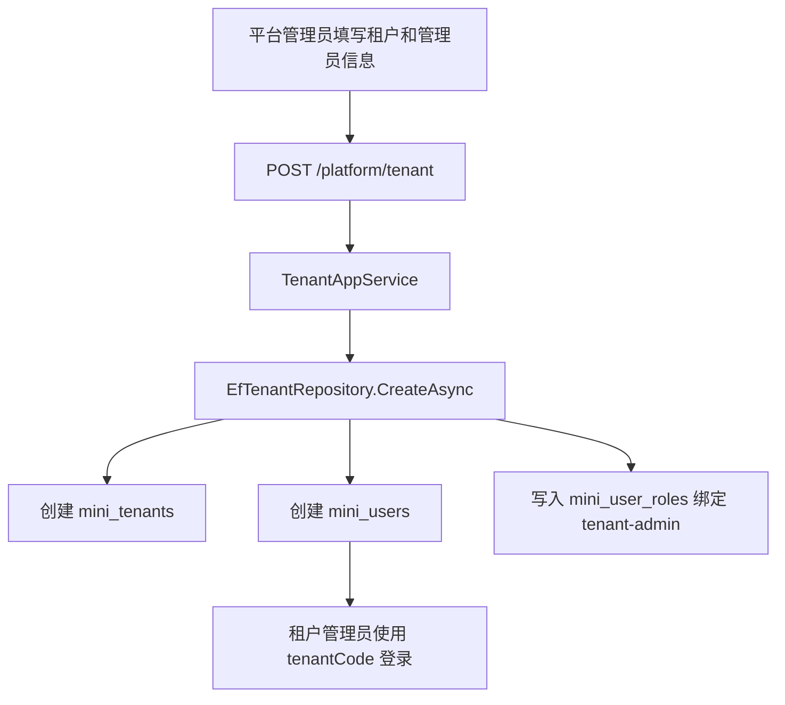

# 租户管理员初始化需求文档

## 背景

平台租户管理已经支持租户查询、新增、编辑、启用和停用。当前新增租户只会创建租户档案，租户创建后还缺少可登录的租户管理员账号，SaaS 开通流程没有形成闭环。

## 目标

- 平台管理员新增租户时，可以同步填写租户管理员信息。
- 后端创建租户成功后，同步创建一个归属于该租户的管理员用户。
- 租户管理员绑定内置 `tenant-admin` 角色。
- 租户管理员可以使用“租户编码 + 用户名 + 密码”登录。
- 前端新增租户弹窗增加管理员信息区域。

## 范围

- 扩展 `CreateTenantRequest`，增加管理员用户名、姓名、邮箱、初始密码。
- 新增或补齐 `tenant-admin` 角色种子。
- 新增租户时在同一保存流程内创建租户管理员用户和用户角色关系。
- 前端租户新增表单收集管理员信息。
- 补充后端集成测试、前端构建验证和总结文档。

## 非目标

- 本阶段不做租户内完整菜单裁剪。
- 本阶段不做租户套餐限制。
- 本阶段不做平台代入租户。
- 本阶段不允许同一用户名跨租户重复，仍沿用当前全局唯一用户名规则。

## 验收标准

- 新增租户接口传入管理员信息后，会创建租户和对应租户管理员用户。
- 创建出的管理员用户 `TenantId` 等于新租户 ID。
- 管理员用户拥有 `tenant-admin` 角色。
- 使用新租户编码和管理员账号可以登录。
- 缺少管理员用户名、姓名或密码时新增租户失败。
- 用户名重复时新增租户失败。

## 数据流

