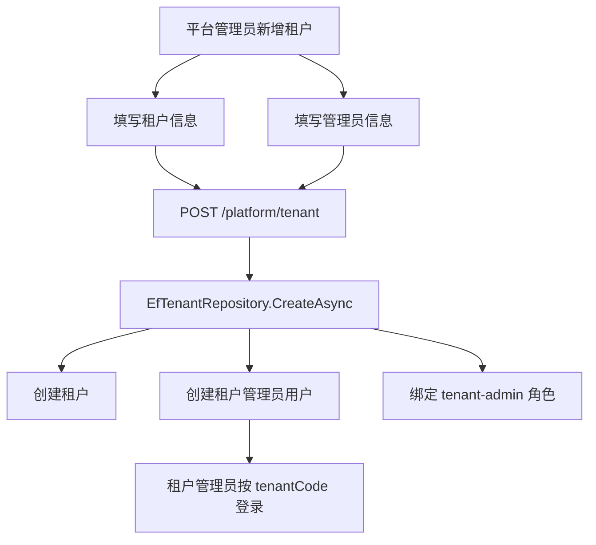

# 租户管理员初始化功能总结

## 本次完成

- 新增租户时必须填写管理员账号、姓名和初始密码。
- 后端创建租户时同步创建租户管理员用户。
- 租户管理员用户会写入 `TenantId`，归属于新创建的租户。
- 租户管理员绑定内置 `tenant-admin` 角色。
- `tenant-admin` 角色会在初始化时幂等补齐，并默认拥有工作台入口。
- 租户管理员可以使用“租户编码 + 管理员账号 + 密码”登录。
- 前端租户新增弹窗增加“管理员信息”区域，编辑租户时不展示管理员密码字段。

## 关键业务规则

- 用户名当前仍然全局唯一，不允许不同租户使用相同登录账号。
- 新增租户缺少管理员账号、姓名或初始密码时返回 400。
- 管理员用户名已存在时返回 400。
- 新增租户和创建租户管理员在同一个保存流程内完成，避免只创建租户但没有可登录账号。

## 数据流

## 验证记录

- `dotnet test C:\monica\code\mini-admin\tests\MiniAdmin.Tests\MiniAdmin.Tests.csproj --filter "TenantAdmin"`：2 个测试通过。
- `dotnet test C:\monica\code\mini-admin\tests\MiniAdmin.Tests\MiniAdmin.Tests.csproj --filter "PlatformTenant|TenantAdmin"`：4 个相关测试通过。
- `dotnet test C:\monica\code\mini-admin\MiniAdmin.slnx`：110 个测试通过。
- `pnpm run build:antd`：前端构建通过。
- `http://localhost:5320/health`：后端服务返回 `Healthy`。
- `http://localhost:5666/`：前端服务返回 200。

## 下一步建议

- 给业务表逐步增加 `TenantId` 自动隔离，先从用户、角色、部门这类系统管理表开始。
- 完善租户管理员默认权限，支持平台按租户套餐下发菜单能力。
- 做“平台代入租户”功能，并强制记录审计日志。
