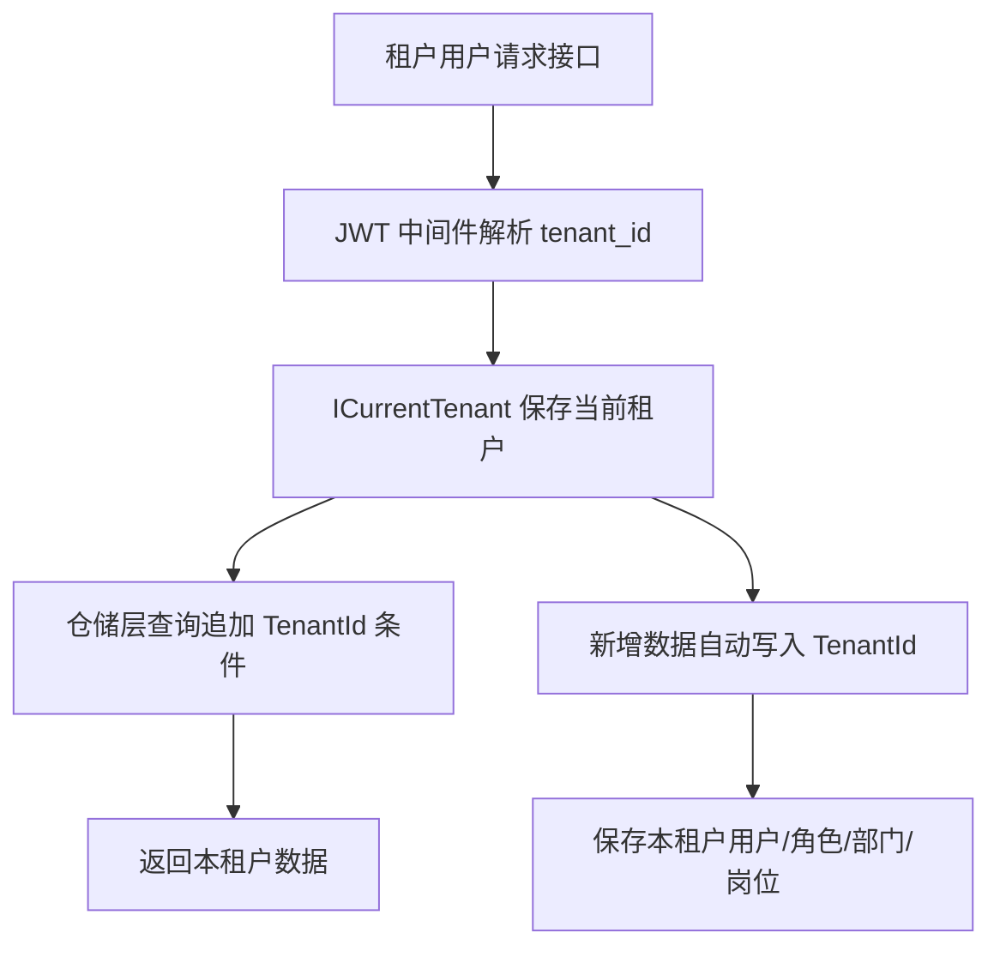

# 租户数据隔离第一阶段需求文档

## 背景

系统已经具备 SaaS 租户、租户管理员、租户编码登录和登录页动态租户选择能力。下一步必须确保租户用户只能看到和操作本租户的数据，否则 SaaS 后台的安全边界不完整。

## 目标

- 用户、角色、部门、岗位支持租户隔离。
- 平台用户不属于任何租户，可以维护平台级数据并查看全部数据。
- 租户用户属于某个租户，只能查看、创建、编辑、删除本租户数据。
- 租户用户新增用户、角色、部门、岗位时，后端自动写入当前 `TenantId`。
- 租户用户不能把平台角色或其他租户角色分配给本租户用户。
- 租户用户不能把用户挂到平台部门、其他租户部门或其他租户岗位。

## 范围

第一阶段只处理以下系统管理数据：

- 用户 `mini_users`
- 角色 `mini_roles`
- 部门 `mini_departments`
- 岗位 `mini_positions`

## 非目标

- 本阶段不处理字典、参数、文件、通知、公告、审计日志等模块的租户隔离。
- 本阶段不做租户套餐菜单授权。
- 本阶段不做平台管理员代入租户。
- 本阶段不做每租户独立数据库。

## 业务规则

| 场景 | 平台用户 | 租户用户 |
| --- | --- | --- |
| 用户列表 | 可看全部 | 只看本租户 |
| 新增用户 | 创建平台用户 | 创建本租户用户 |
| 编辑/删除用户 | 可操作全部，内置保护除外 | 只可操作本租户用户 |
| 角色列表 | 可看全部 | 只看本租户角色 |
| 新增角色 | 创建平台角色 | 创建本租户角色 |
| 部门树 | 可看全部平台/租户部门 | 只看本租户部门 |
| 岗位列表 | 可看全部平台/租户岗位 | 只看本租户岗位 |

## 数据流

## 验收标准

- `jxnc` 租户用户不能看到 `demo` 或平台用户。
- `jxnc` 租户用户不能看到平台角色、部门、岗位。
- 租户用户新增用户时，新用户自动归属当前租户。
- 租户用户无法给本租户用户分配平台角色或其他租户角色。
- 后端有回归测试覆盖关键隔离规则。
