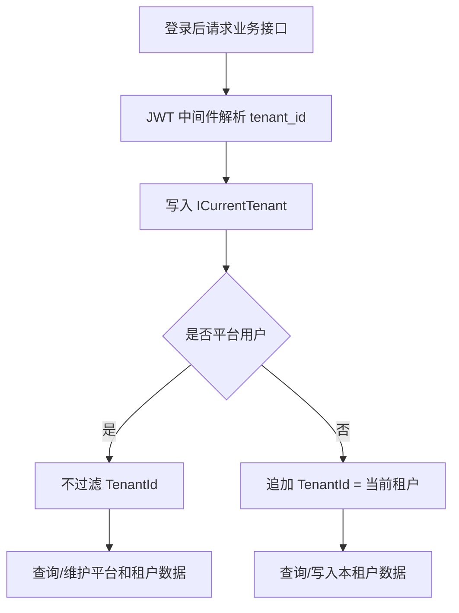

# 租户数据隔离第一阶段总结文档

## 本次完成内容

本阶段完成了用户、角色、部门、岗位四类核心组织权限数据的租户隔离。系统现在以 JWT 中解析出的 `tenant_id` 为当前租户上下文，仓储层在查询、创建、编辑、删除和关联校验时显式执行租户边界判断。

## 关键实现

- `Role`、`Department`、`Position` 增加 `TenantId` 和 `Tenant` 导航属性。
- EF Core 映射增加租户索引和租户关系。
- MySQL 老库启动兼容升级会自动给角色、部门、岗位表补 `TenantId` 字段和索引。
- 用户、角色、部门、岗位仓储接入 `ICurrentTenant`。
- 平台用户保持 `TenantId = null`，可管理平台级数据和全部租户数据。
- 租户用户只能查看和操作本租户用户、角色、部门、岗位。
- 租户用户新增用户、角色、部门、岗位时，后端自动写入当前 `TenantId`。
- 用户新增、导入、编辑时校验角色、部门、岗位必须属于当前租户。
- 租户管理员默认权限补齐系统管理基础菜单，避免租户登录后没有用户、角色、部门、岗位管理入口。

## 数据边界

## 验证结果

- 租户隔离测试：`dotnet test C:\monica\code\mini-admin\tests\MiniAdmin.Tests\MiniAdmin.Tests.csproj --filter "TenantDataIsolation"`，1 个测试通过。
- 后端完整测试：`dotnet test C:\monica\code\mini-admin\MiniAdmin.slnx`，113 个测试通过。
- 前端构建：`pnpm run build:antd`，构建通过。

## 当前限制

- 本阶段只隔离用户、角色、部门、岗位。
- 字典、参数、文件、通知公告、审计日志等模块后续需要按同样思路继续隔离。
- 角色、部门、岗位编码的唯一性仍是全局级别，后续企业级 SaaS 可升级为租户内唯一。
- 本阶段没有引入 EF 全局查询过滤器，先采用仓储层显式过滤，便于教学理解和逐步演进。

## 建议验收

1. 使用平台 `admin` 登录，确认仍可看到平台数据和租户数据。
2. 使用 `jxnc` 租户管理员登录，进入用户、角色、部门、岗位页面。
3. 确认 `jxnc` 看不到 `demo` 或平台用户、角色、部门、岗位。
4. 在 `jxnc` 下新增一个用户，刷新后确认仍只出现在 `jxnc` 租户下。
5. 尝试给 `jxnc` 用户分配平台角色或其他租户角色，后端应拒绝。

## 下一步

建议继续做租户套餐和菜单授权。也就是租户不仅有自己的数据，还要能控制这个租户允许使用哪些菜单和功能按钮，这是 SaaS 后台的第二道核心边界。
