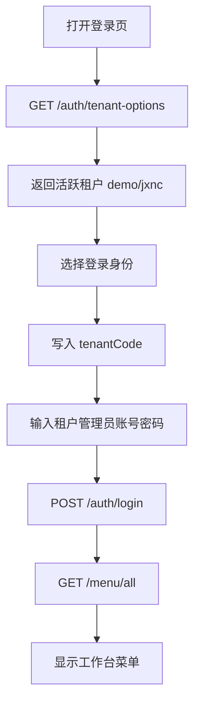

# 租户登录选项和默认菜单修复总结

## 本次问题

新增 `jxnc` 租户后，登录页下拉仍然只有 `Admin` 和 `demo`，原因是前端登录页使用了硬编码选项，没有从后端读取租户列表。

租户管理员登录后无菜单的风险来自两个点：

- 新增租户流程只创建了 `tenant-admin` 角色和用户关系，没有在创建流程内确保角色菜单完整。
- 如果之前登录过并缓存了空菜单，后续即使补齐角色菜单，也可能继续读到旧缓存。

## 本次修复

- 新增公开接口 `/auth/tenant-options`，返回启用且未过期的租户。
- 登录页动态加载租户选项，保留 Admin 平台入口。
- 选择租户时自动写入租户编码；非 demo 租户需要手动输入对应管理员账号和密码。
- 创建租户时同步确保 `tenant-admin` 有 Dashboard/Workspace 默认菜单。
- 系统启动时清理所有租户管理员权限缓存。

## 数据流

## 使用说明

- `Admin` 是平台管理员入口，租户编码为空。
- `demo` 会自动填入 `demo / 123456`。
- `jxnc` 这类新租户只会自动填入租户编码，需要输入创建租户时填写的管理员账号和初始密码。

## 验证结果

- 租户相关回归测试通过：5 个测试。
- 后端完整测试通过：112 个测试。
- 前端构建通过。
- 后端服务已启动并返回 `Healthy`。
- 前端服务已启动并返回 200。
- `/auth/tenant-options` 已返回 `demo` 和 `jxnc`。
