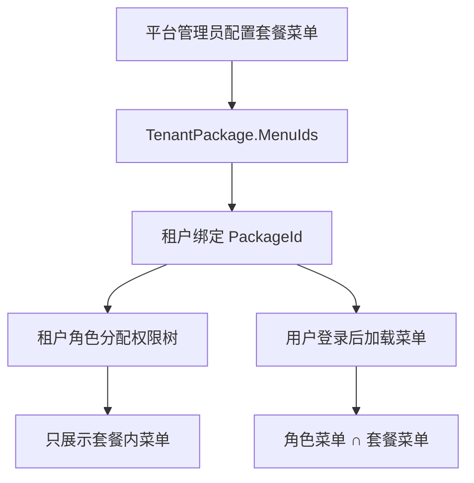

# 租户套餐菜单授权需求文档

## 背景

租户数据已经完成第一阶段隔离，但租户还能否使用某个功能，目前主要取决于角色菜单。企业级 SaaS 还需要平台层套餐作为功能上限，控制租户可使用的菜单和按钮。

## 目标

- 平台管理员维护租户套餐。
- 套餐绑定菜单和按钮权限。
- 租户绑定套餐。
- 租户用户最终权限为角色权限和套餐权限的交集。
- 租户管理员分配角色权限时，只能选择套餐内菜单。
- 套餐权限缩小时，自动清理使用该套餐的租户角色中超出套餐的权限。

## 范围

- 租户套餐列表、新增、编辑、启停。
- 租户套餐菜单授权。
- 租户管理选择套餐。
- 菜单和按钮权限计算接入套餐上限。
- 角色权限分配接入套餐上限。

## 非目标

- 不做计费购买。
- 不做套餐变更审批。
- 不做套餐版本历史。
- 不做租户自助升级。

## 业务规则

| 场景 | 规则 |
| --- | --- |
| 平台用户 | 不受套餐限制 |
| 租户用户菜单 | 角色菜单和套餐菜单取交集 |
| 租户角色分配权限 | 只能看到套餐允许的菜单 |
| 保存租户角色权限 | 超出套餐的菜单 ID 后端自动过滤 |
| 缩小套餐权限 | 自动删除关联租户角色中套餐外的 `RoleMenu` |
| 停用套餐 | 已绑定租户仍可保留套餐记录，但不建议新租户选择 |

## 数据流

## 验收标准

- 平台管理员可以新增、编辑、启停套餐。
- 平台管理员可以给套餐分配菜单和按钮权限。
- 租户管理可以选择套餐。
- 租户用户看不到套餐外菜单。
- 租户角色无法保存套餐外菜单权限。
- 套餐权限收缩后，相关租户角色的超出权限会被自动清理。
