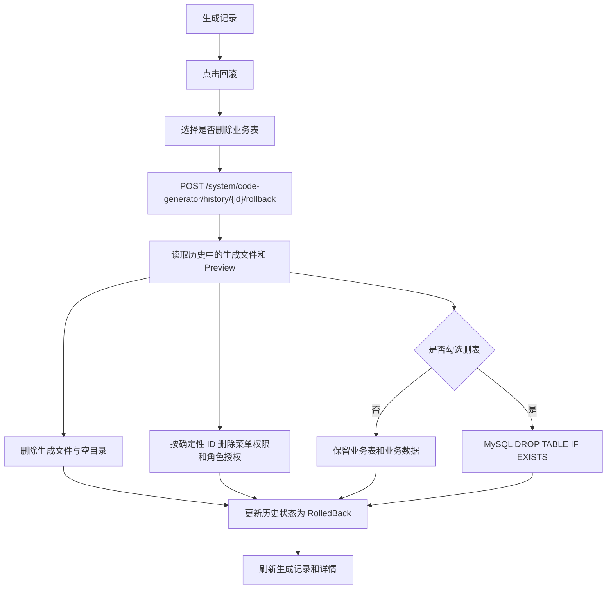

# 代码生成器第三阶段：生成产物治理与回滚需求

## 背景

代码生成器已经可以预览、生成、自动安装数据库表和菜单权限。随着生成模块增多，需要有治理能力，避免测试模块、误生成模块长期残留在代码和权限数据中。

## 目标

- 在生成记录中提供回滚入口。
- 回滚删除本次生成写出的代码文件和空目录。
- 回滚删除本次生成自动注册的菜单、按钮权限和角色授权。
- 回滚后生成记录状态更新为 `RolledBack`。
- 回滚过程保留业务表和业务数据，不默认 drop table。
- 回滚弹窗提供危险选项，勾选后才尝试删除业务表和表内数据。
- 只有拥有 `system:code-generator:rollback` 或 `system:code-generator:generate` 权限的用户可以执行回滚。

## 非目标

- 不默认删除业务表。
- 不在未明确勾选危险选项时删除任何业务数据。
- 不处理用户手工修改过的生成文件差异合并。
- 不做 Git revert 或自动提交。
- 不回滚生成前已经存在的同名文件，因为生成器默认阻止冲突覆盖。

## 验收标准

- 成功生成并自动安装后，调用回滚接口会删除生成文件。
- 回滚会删除生成菜单权限和对应 `RoleMenus`。
- 勾选“同时删除业务表和表内数据”时，MySQL 环境会尝试 `DROP TABLE`。
- 未勾选删表或当前数据库不支持自动删表时，接口会返回清晰的跳过原因。
- 已经 `RolledBack` 的记录允许继续执行“清理表”，用于补救第一次回滚时未勾选删表的场景。
- 历史详情状态变为 `RolledBack`。
- 再次回滚同一记录返回明确错误。
- 前端生成记录和详情能看到回滚动作。

## 数据流

