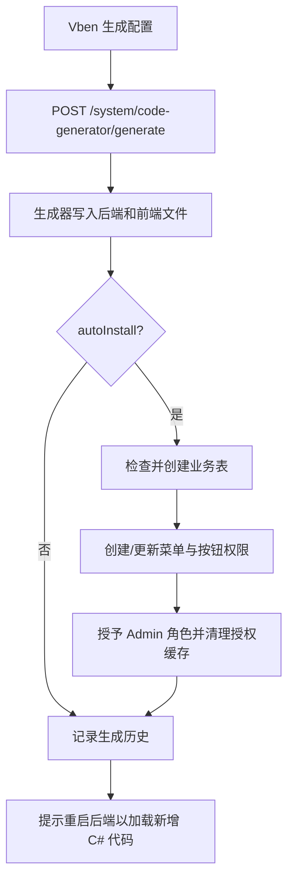

# 代码生成器第二阶段：生成后自动安装需求

## 背景

第一阶段已经完成企业级生成模板：可以从数据库表或手工字段生成后端 CRUD、Vben 页面、菜单权限种子、租户隔离、数据权限和审计提示。

当前缺口是生成后的落地链路仍然偏手工：

- 目标业务表不存在时，需要复制预览里的 MySQL 建表脚本手工执行。
- 菜单和按钮权限依赖生成后的 `MenuSeed` 类在下一次后端重启后才会生效。
- 管理员生成代码后，不能马上在菜单权限数据里看到新模块。

## 目标

生成代码成功后，系统自动完成数据库侧安装：

- 自动检查目标表是否存在。
- 表不存在且启用自动安装时，执行生成器给出的 MySQL 建表脚本。
- 自动创建或更新业务菜单、查询/新增/编辑/删除按钮权限。
- 自动把这些菜单权限授予 Admin 角色。
- 清理 Admin 用户授权缓存，让后续菜单和权限读取使用最新数据。
- 保留“重启后端”步骤，因为新增 C# 代码仍需要重新编译后才能挂载接口。

## 非目标

- 不做运行时动态编译 C#。
- 不自动覆盖冲突文件。
- 不把生成模块自动授予普通租户角色或测试角色。
- 不在非 MySQL 关系库上执行 MySQL 建表脚本。

## 验收标准

- 生成请求支持 `autoInstall` 开关，默认开启。
- 前端生成按钮旁能看到“生成后自动安装数据库表和菜单权限”的开关。
- 开启自动安装时，生成成功后菜单权限数据立即写入数据库。
- Admin 角色拥有新模块菜单和四个按钮权限。
- 历史详情里的安装指引能体现表、菜单权限和后端重启的当前状态。
- 关闭自动安装时，只写文件和历史，不安装表和菜单权限。

## 数据流

