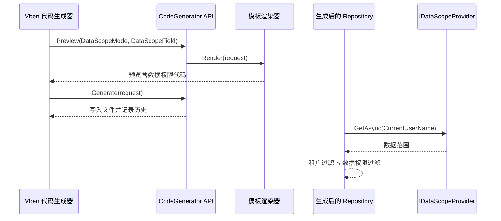

# 代码生成器企业级模板增强需求文档

## 背景

代码生成器已经可以读取 MySQL 表、选择字段、预览文件、生成后端 CRUD 和 Vben 页面，也已经具备租户隔离的基础模板。下一步需要让生成出来的业务模块更接近企业后台的默认要求，避免每个新业务模块都手工补租户、权限和审计能力。

## 目标

- 保留现有预览优先、冲突检测、生成记录能力。
- 租户级模块继续自动生成 `TenantId` 和租户查询过滤。
- 新增数据权限配置，生成的模块可以接入当前 RBAC 数据范围。
- 数据权限不仅限制列表，也限制编辑和删除，避免只做前端隐藏。
- 安装指引中明确展示租户、数据权限、审计日志的落地状态。

## 功能范围

### 数据权限模式

第一版支持三种模式：

| 模式 | 说明 |
| --- | --- |
| `None` | 不生成数据权限过滤 |
| `Department` | 按部门字段过滤，例如 `DepartmentId` |
| `Self` | 按用户字段过滤，例如 `OwnerUserId` |

启用数据权限时必须选择一个字段：

- `Department` 模式建议选择 `DepartmentId`。
- `Self` 模式建议选择 `UserId`、`OwnerUserId`、`CreatedByUserId` 等用户标识字段。

### 后端生成要求

- DTO 请求模型增加 `DataScopeMode`、`DataScopeField`、`EnableAudit`。
- 模板校验数据权限字段是否存在于生成字段中。
- 生成的 Repository 注入 `IDataScopeProvider`。
- 生成的 ListQuery 携带 `CurrentUserName`，由 Endpoint 从登录用户中填入。
- 列表查询调用 `ApplyDataScopeAsync`。
- 更新和删除在查询目标实体时同样应用数据权限。
- 租户过滤和数据权限可以叠加。

### 前端生成器页面

- 配置区增加“数据权限模式”和“数据权限字段”。
- 数据权限字段从当前已选择字段中选择。
- 生成目标或安装指引可以让用户看到当前模板能力。

### 审计

当前系统已有请求审计和实体变更审计。生成模块通过 Minimal API 和 EF Core 写入后，可以被现有审计中间件与变更捕获能力覆盖。第一版不为每个生成模块额外生成审计代码，只在安装指引中明确提示“由系统审计统一覆盖”。

## 数据流

## 验收标准

- `Department` 数据权限预览中包含 `IDataScopeProvider`、`ApplyDataScopeAsync`、`DepartmentIds.Contains`。
- 生成的列表 Endpoint 会把当前登录用户名写入查询对象。
- 生成的更新、删除不会绕过数据权限。
- 未启用数据权限时，生成内容保持现有简洁模板。
- 前端可以选择数据权限模式和字段。
- 后端测试、前端构建通过。
