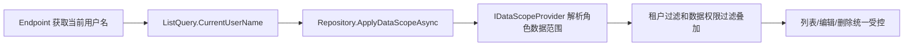

# 代码生成器企业级模板增强完工总结

## 完成内容

- 代码生成请求新增 `DataScopeMode`、`DataScopeField`、`EnableAudit`。
- 生成器支持 `None`、`Department`、`Self` 三种数据权限模式。
- 启用数据权限时，后端会校验必须选择有效字段。
- 生成的 Repository 会注入 `IDataScopeProvider`。
- 生成的列表、编辑、删除都会应用数据权限过滤。
- 租户过滤和数据权限可以叠加。
- 生成的 Endpoint 会从登录用户中读取用户名，并写入查询或写操作。
- 安装指引新增租户隔离、数据权限、审计追踪步骤。
- Vben 代码生成器页面新增数据权限模式、权限字段、审计提示配置。
- 修复一个历史生成产物启动冲突：生成器产物 `Alerts` 不再映射正式告警表 `mini_alerts`，改为 `biz_alerts_generated`，避免和系统告警实体 `Alert` 抢同一张表。

## 关键设计

数据权限没有做成前端隐藏按钮，而是写入生成后的后端 Repository：

## 验证结果

- `dotnet test C:\monica\code\mini-admin\tests\MiniAdmin.Tests\MiniAdmin.Tests.csproj -c Release --filter "CodeGenerator"`：10 passed。
- `npx impeccable --json frontend\vue-vben-admin\apps\web-antd\src\views\system\code-generator\index.vue`：无问题。
- `pnpm run build:antd`：11/11 successful。
- 后端 `http://localhost:5320/health`：Healthy。
- 前端 `http://localhost:5666/`：HTTP 200。

构建末尾仍会输出已有环境提示：`Requested version v22.22.0 is not currently installed`，但命令退出码为 0。

## 使用方式

进入 `系统工具 / 代码生成器`：

1. 选择业务表。
2. 确认字段中有 `DepartmentId` 或 `OwnerUserId` 一类字段。
3. 数据权限选择“按部门字段”或“按用户字段”。
4. 权限字段选择对应字段。
5. 点击预览，检查 Repository 是否生成数据权限过滤。

## 后续建议

- 让字段识别更智能：读取外键或字段名自动推荐部门/用户字段。
- 预览页增加“企业能力检查清单”，直接显示租户、数据权限、审计、菜单权限是否就绪。
- 生成后的业务模块可以增加导入、导出模板能力。
