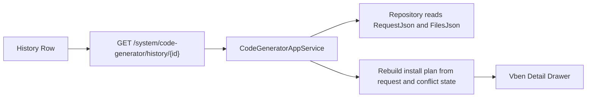

# Code Generator History Detail Requirements

## Background

The code generator records each generation attempt, but the current history list only shows basic metadata. An enterprise code generator should let developers inspect what was generated, which request produced it, what files were written, and what installation steps remain.

## Goals

- Add a generation history detail API.
- Return the original preview request stored in `RequestJson`.
- Return the generated file list and conflict status.
- Return an install plan recalculated from the original request.
- Show a detail panel in Vben with request summary, install steps, SQL draft, files, and raw request JSON.

## Scope

- The first version is read-only.
- No automatic rollback.
- No automatic SQL execution.
- No file deletion from the UI.

## Data Flow

## Acceptance Criteria

- A generated history item can be fetched by id.
- Detail response includes `preview`, `files`, `installPlan`, and operator metadata.
- Missing history id returns 404.
- Vben history table has a detail action.
- Detail drawer shows install guidance and SQL draft when available.
