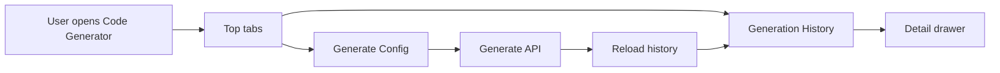

# Code Generator History Entry And Customer Demo Requirements

## Background

The code generator history list existed but was placed at the bottom of the page, making it hard to find. A generated demo page also showed `mini_notices` as the page title even though it is now registered as the customer demo module.

## Requirements

- Make generation history visible as a first-level page area in the code generator screen.
- Keep the history detail drawer available from each history row.
- After successful generation, guide the user to the history area.
- Rename the generated customer demo UI from `mini_notices` to customer-oriented labels.
- Rename the generated sample order demo UI from `mini_files` to sample-order-oriented labels.
- Ensure the generated customer and sample order demo tables can be created automatically in MySQL startup repair flow.
- Keep the fix scoped to generated demos and avoid disturbing the real notice/file modules.

## Data Flow

