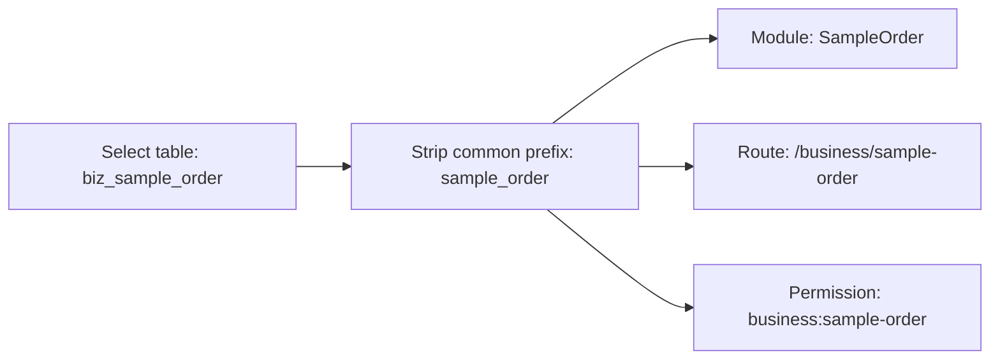

# Code Generator Table Naming Requirements

## Background

When a user selected another database table, the code generator only refreshed `tableName`, business name, and fields. The default module settings still pointed to `SampleOrder`, so preview reported conflicts for `sample-order.ts` even when the selected table was unrelated.

## Requirements

- Selecting a table must also refresh module name, route path, and permission prefix.
- Default generator form should start empty to avoid accidental reuse of demo module names.
- The page should show the current target files before preview/generate so conflicts are understandable.
- Keep generated target paths predictable and consistent with Vben route conventions.

## Naming Rule

