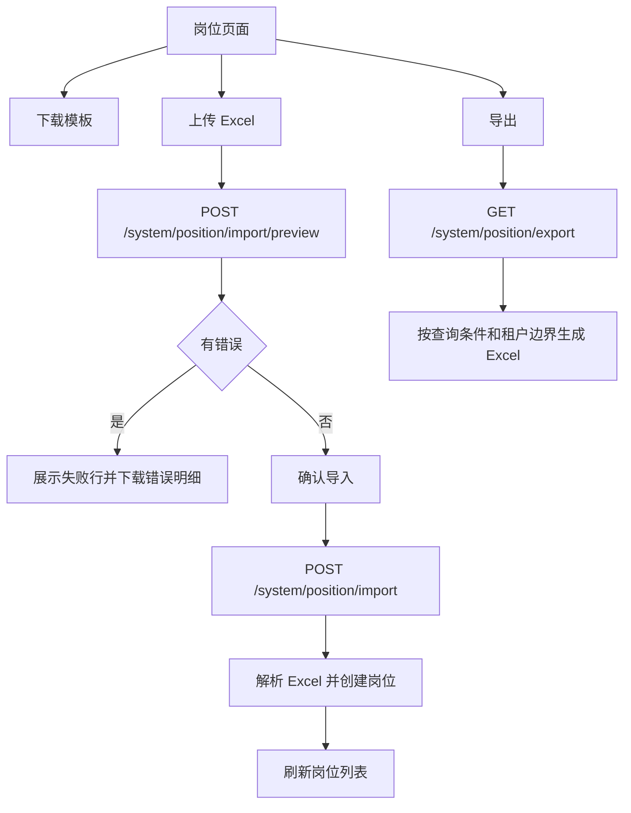

# 通用导入导出与代码生成器联动需求

## 背景

系统已经具备用户导入导出、代码生成器 CRUD、生成历史和回滚能力。企业后台里的业务模块通常还需要列表导出、模板下载、导入预检、确认导入和失败明细。继续把这些能力做成通用基础设施，可以减少后续每个模块重复实现，也能让代码生成器生成更接近企业可用的模块。

## 目标

- 抽出通用 Excel 读写服务，复用现有轻量 xlsx 实现，不新增大型依赖。
- 先在岗位管理落地导出、模板下载、导入预检、确认导入、失败明细。
- 导入默认先预检，有错误时不能确认导入。
- 导入确认时创建岗位，重复编码、必填缺失、排序非法等返回行级错误。
- 导出遵循当前查询条件和租户数据边界。
- 权限独立控制：导入、导出分别走按钮权限。
- 代码生成器增加“导入导出”选项，生成 API、前端按钮和权限种子。

## 非目标

- 本阶段不把用户导入导出迁移到通用框架。
- 本阶段不做服务端长期保存导入文件。
- 本阶段不做导入历史记录。
- 本阶段不支持复杂 Excel 样式、公式和多 sheet。
- 本阶段不做异步大文件任务，单次导入以中小批量为主。

## 验收标准

- 岗位列表可以下载当前筛选结果的 Excel。
- 岗位页面可以下载导入模板。
- 上传模板后可以先预检，返回预计成功数和失败行。
- 失败明细可以下载为 Excel。
- 预检无错误后确认导入，岗位列表出现新增岗位。
- 租户用户导入岗位时，新岗位归属当前租户。
- 代码生成器勾选导入导出后，预览文件中包含导入导出 API、前端按钮和权限。

## 数据流

