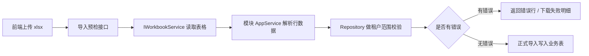

# 通用导入导出能力总结

## 本次完成

- 抽出公共 Excel 读写服务 `IWorkbookService` / `XlsxWorkbookService`，继续沿用轻量 OpenXML 实现，不引入大型依赖。
- 用户原有导入导出服务改为复用公共 Excel 服务，保持原接口不变。
- 岗位管理新增导出、导入模板、导入预览、正式导入、失败明细导出接口。
- 岗位管理前端新增导出、下载模板、导入预检、确认导入、失败明细下载。
- 新增岗位权限：
  - `system:position:import`
  - `system:position:export`
- 代码生成器新增 `EnableImportExport` 开关，开启后生成：
  - 后端导入导出接口
  - 前端导入导出 API 和页面按钮
  - `:import` / `:export` 权限
  - 菜单权限种子和自动安装权限

## 数据流

## 验证结果

- `dotnet test ... --filter "PositionImportExport|CodeGenerator"`：通过 15 条。
- `npx impeccable --json .../position/index.vue`：通过，返回 `[]`。
- `npx impeccable --json .../code-generator/index.vue`：通过，返回 `[]`。
- `pnpm run build:antd`：构建成功，仍有既有提示 `Requested version v22.22.0 is not currently installed`，但退出码为 0。

## 后续建议

- 下一阶段可以把用户导入导出的业务校验也迁移到同一套通用框架命名下，保留用户特有的部门、岗位、角色校验。
- 代码生成器后续可以继续增强为“字段级导入配置”，例如每个字段是否可导入、导入列名、默认值、字典转换规则。
