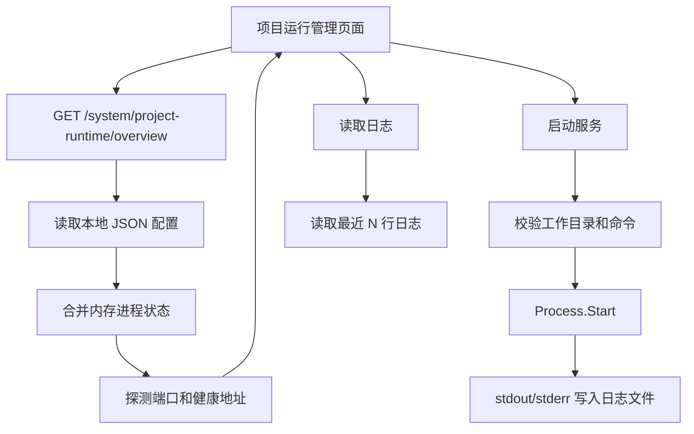

# 项目运行管理第一版需求

## 背景

系统已经具备系统监控、定时任务、告警中心和代码生成器。日常开发 MiniAdmin 时，还需要频繁启动后端、启动 Vben 前端、查看日志、识别端口占用和处理数据库不可用。把这些能力做成后台里的项目运行管理，可以让系统从业务后台继续扩展成企业内部开发控制台。

## 目标

- 支持多项目管理，不只绑定 MiniAdmin。
- 采用 Project -> Workspace -> Service 模型：
  - Project 表示一个项目，例如 MiniAdmin。
  - Workspace 表示一个本地目录、分支或 worktree。
  - Service 表示该工作区下可启动的后端、前端或自定义进程。
- 第一版支持登记本地已有项目和服务定义。
- 支持查看项目、工作区、服务状态、端口、健康地址、日志摘要。
- 支持启动、停止、重启单个服务，以及启动、停止整个工作区。
- 服务输出写入本地日志文件，页面可查看最近日志。
- 支持端口探测和健康地址探测，能区分 Running、Stopped、Failed、Unknown。
- 支持打开前端访问地址。
- 菜单放在“开发工具”下，只有具备权限的管理员可访问和操作。

## 非目标

- 第一版不做远程克隆。
- 第一版不自动创建或删除 git worktree。
- 第一版不做命令级自由终端。
- 第一版不接入分布式运行节点。
- 第一版不把运行配置落数据库，先使用本地 JSON 配置文件。
- 第一版不自动修改项目源码或配置文件。

## 验收标准

- 后台出现“开发工具 / 项目运行管理”菜单。
- 页面可看到 MiniAdmin 默认项目、main 工作区、API 与 Vben 两个服务。
- 可以新增其他本地项目和工作区服务定义。
- 点击启动服务后，后端能创建进程并写入日志。
- 点击停止服务后，后端能停止由本面板启动的进程。
- 服务已有端口被外部进程占用时，页面能显示“端口占用/未知运行态”，不会重复启动。
- 页面能查看最近 200 行日志。
- 构建通过，后端接口能正常编译。

## 数据流

