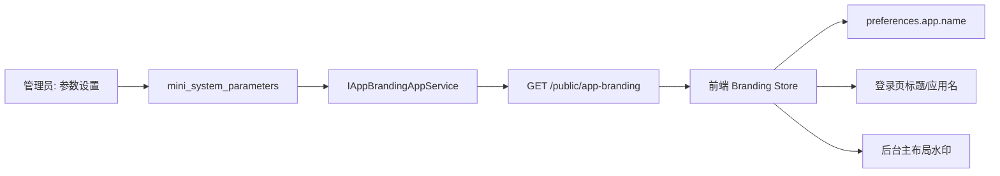

# 应用品牌与全局水印执行文档

## 执行步骤

1. 在应用契约层新增品牌配置 DTO 和服务接口。
2. 在应用层实现品牌配置服务，从系统参数仓储读取配置并做默认值兜底。
3. 在 API 层注册服务并开放 `GET /public/app-branding`。
4. 在初始化数据中补充品牌与水印参数，保留管理员已有配置。
5. 前端新增品牌配置 API 与 Pinia store。
6. 前端启动阶段读取配置并同步到 Vben preferences。
7. 登录页使用后端配置的短名称和登录标题。
8. 主布局水印使用后端参数控制启停和内容。

## 数据流

## 兼容策略

- `.env` 中的 `VITE_APP_TITLE` 调整为 `MiniAdmin`，作为后端接口异常时的前端兜底。
- 如果水印参数关闭，则销毁水印。
- 如果水印开启但没有配置文字，则默认显示当前用户信息；仍没有用户信息时显示系统名称。
- 种子参数使用保留已有值策略，避免重启覆盖管理员配置。
