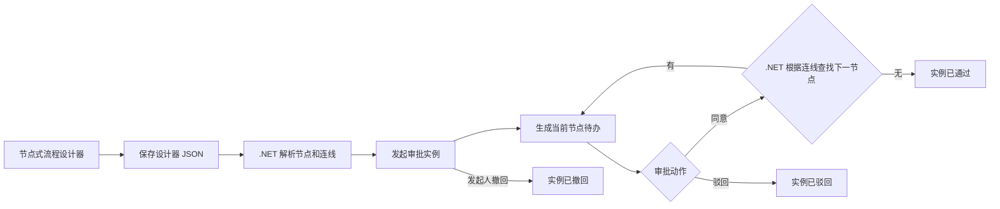

# 工作流一期任务执行文档

## 数据流

## 后端任务

1. 新增领域实体：
   - `WorkflowDefinition`
   - `WorkflowNode`
   - `WorkflowInstance`
   - `WorkflowTask`
   - `WorkflowActionLog`

2. 新增应用契约：
   - DTO。
   - 查询对象。
   - 保存流程定义请求。
   - 发起、审批、驳回、撤回请求。
   - 应用服务接口和仓储接口。

3. 新增应用服务：
   - 参数校验。
   - 调用仓储完成定义维护和实例流转。

4. 新增 EF 仓储：
   - 按当前租户过滤定义和实例。
   - 创建流程定义及节点。
   - 发起流程实例并生成第一节点待办。
   - 保存设计器 JSON。
   - 审批通过后由 .NET 根据画布连线推进下一节点。
   - 驳回和撤回后关闭未完成待办。

5. 扩展数据库初始化：
   - EF DbSet 和模型配置。
   - MySQL 表兜底创建。
   - 工作流菜单和权限种子。
   - 默认租户套餐补齐工作流菜单。

6. 扩展 API：
   - `/workflow/definition/list`
   - `/workflow/definition/options`
   - `/workflow/definition`
   - `/workflow/instance/list`
   - `/workflow/instance/start`
   - `/workflow/instance/{id}`
   - `/workflow/instance/{id}/approve`
   - `/workflow/instance/{id}/reject`
   - `/workflow/instance/{id}/withdraw`
   - `/workflow/task/todo`
   - `/workflow/task/done`

## 前端任务

1. 新增 `src/api/workflow/center.ts`。
2. 新增 `src/views/workflow/center/index.vue`。
3. 页面包含：
   - 流程定义维护。
   - Vue Flow 节点式流程设计器。
   - 发起审批表单。
   - 我的待办列表。
   - 流程实例列表和详情弹窗。
4. 按权限控制按钮：
   - `workflow:definition:manage`
   - `workflow:instance:start`
   - `workflow:task:approve`

## 验证任务

1. 后端测试：流程发起后生成待办，审批后推进并最终通过。
2. `dotnet build MiniAdmin.slnx`。
3. `dotnet test tests/MiniAdmin.Tests/MiniAdmin.Tests.csproj`。
4. `pnpm run build:antd`。
5. 启动后端和前端，验证菜单、页面和流程闭环。
