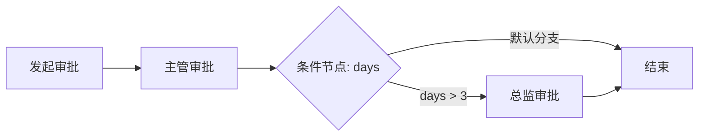

# 工作流条件分支需求文档

## 背景

工作流设计器已经支持条件节点和连线编排，但条件节点之前只保存为设计态数据，后端仍按审批节点顺序推进。企业级审批需要根据表单数据动态选择分支，例如请假天数、采购金额、合同金额等。

## 目标

- 条件节点出口线可以配置判断规则。
- 后端审批流转时能读取发起表单 JSON，并按条件选择下一条分支。
- 支持默认分支，避免没有条件命中时流程卡住。
- 保持现有审批节点、待办、发起、同意、驳回接口不变。

## 条件表达式

本阶段条件表达式采用轻量结构化配置，不引入脚本引擎。

- 字段路径：支持 JSON 点路径，例如 `days`、`amount.total`。
- 运算符：
  - 等于。
  - 不等于。
  - 大于。
  - 大于等于。
  - 小于。
  - 小于等于。
  - 包含。
  - 为空。
  - 不为空。
  - 总是命中。
- 比较值：按数字优先比较，无法按数字比较时按字符串比较。
- 默认分支：条件不命中时优先走默认分支。

## 数据结构

条件配置保存在 `DesignerJson.edges` 上：

```json
{
  "id": "edge-long-director",
  "source": "condition-days",
  "target": "approve-director",
  "label": "大于3天",
  "conditionField": "days",
  "conditionOperator": "GreaterThan",
  "conditionValue": "3",
  "isDefault": false,
  "sort": 0
}
```

## 流转图


