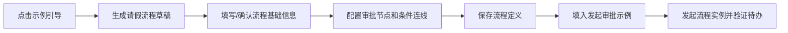

# 工作流定义示例引导需求文档

## 背景

发起审批页已有请求示例，但新增流程定义时缺少真正的分步教学。用户希望在功能页面点击“示例引导”后，由系统一步一步带着完成一个可保存、可发起测试的工作流示例。

## 目标

- 在流程定义页面提供“示例引导”入口。
- 引导必须覆盖完整创建链路：
  - 生成流程草稿。
  - 填写基础信息。
  - 理解画布节点。
  - 配置审批人和条件分支。
  - 保存流程定义。
  - 跳转发起审批并填入请求示例。
- 示例使用请假审批，便于验证条件分支：
  - `days > 3` 进入部门负责人审批。
  - 3 天以内走默认分支结束。
- 引导过程中不绕过原有保存校验，缺少审批人、条件配置等仍由现有校验提示。

## 数据流

## 非目标

- 本次不实现真正的新手遮罩 Tour 逐个锚定 DOM。
- 本次不增加后端接口。
- 本次不自动创建系统用户或角色。
