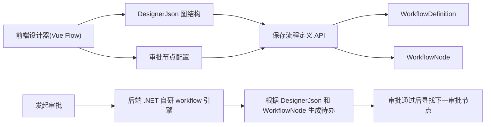

# 工作流设计器工作台需求文档

## 背景

当前审批中心已经具备流程定义、发起审批、待办、已办、实例追踪和基础图执行能力，但流程定义页面仍以表格和弹窗为主。对于企业级后台管理系统来说，工作流设计应当是一个独立的可视化工作台，而不是表格里的附属编辑弹窗。

## 用户目标

- 流程定义页面要更像专业流程设计器。
- 节点要支持拖拉编排。
- 默认审批节点不够用，需要支持自定义节点类型。
- 页面布局要符合当前后台系统风格，简洁、清晰、可维护。
- 明确后端 .NET 工作流技术选型，避免误以为接入了第三方工作流框架。

## 技术说明

当前后端使用的是项目内自研的轻量 .NET workflow 引擎，不是 Elsa、Workflow Core 或 OptimaJet 等第三方库。

- 流程图结构保存在 `WorkflowDefinition.DesignerJson`。
- 可执行审批节点保存在 `WorkflowNode`，并通过 `DesignerNodeId` 和前端图节点关联。
- 发起流程时，后端从开始节点连线寻找第一个可执行审批节点。
- 审批通过时，后端根据当前审批节点连线寻找下一个可执行审批节点或结束节点。
- 前端 Vue Flow 只负责设计体验，真正流程推进仍由 .NET 后端执行。

## 本阶段范围

- 将流程定义页从弹窗编辑改为三栏工作台：
  - 左侧流程库。
  - 中间流程画布。
  - 右侧流程和节点属性。
- 新增自定义节点视觉类型：
  - 开始节点。
  - 审批节点。
  - 条件节点。
  - 抄送节点。
  - 结束节点。
- 继续使用 `@vue-flow/core` 作为前端画布能力。
- 审批节点参与后端执行。
- 条件、抄送、额外结束节点本阶段先保存为设计态节点，后续再增强条件表达式、通知和分支执行。

## 非本阶段范围

- 不引入 BPMN 标准引擎。
- 不接入第三方 .NET 工作流库。
- 不实现复杂条件表达式、会签、或签、加签、转办。
- 不改变现有审批闭环接口。

## 数据流

