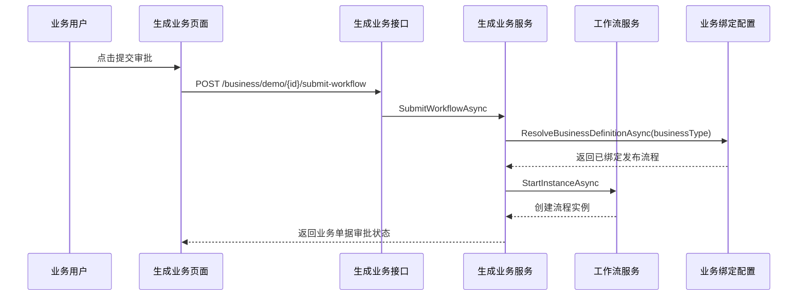

# 代码生成器接入工作流绑定需求文档

## 背景

当前系统已经具备工作流定义、版本发布、业务绑定配置，以及示例订单接入审批的真实样板。但新增业务模块仍然需要手工补充审批字段、提交审批接口、撤回接口和前端操作。

企业级后台里，客户、合同、采购、报销等业务模块经常需要审批能力。代码生成器应该能在生成 CRUD 模块时，选择性生成审批接入骨架，让业务模块通过业务类型编码去解析已配置的工作流定义，减少重复开发。

## 目标

- 在代码生成器里增加“启用审批”配置。
- 启用审批后，要求填写业务类型编码，例如 `contract`、`purchase_order`。
- 生成的实体、DTO、接口、应用服务、API、前端页面包含审批接入骨架。
- 生成的提交审批逻辑通过 `IWorkflowAppService.ResolveBusinessDefinitionAsync` 根据业务类型查找绑定流程。
- 生成的前端页面展示审批状态，并提供提交审批、撤回审批、查看流程入口。
- 生成的权限菜单包含提交审批、撤回审批按钮权限。

## 功能范围

- 后端代码生成器请求参数扩展。
- 后端代码生成器参数校验扩展。
- 后端模板生成：
  - 领域实体审批字段。
  - DTO 审批字段和请求对象。
  - AppService 接口审批方法。
  - AppService 审批提交、撤回方法。
  - Repository 审批状态更新方法。
  - API 提交、撤回接口。
  - 菜单按钮权限。
  - 建表 SQL 追加审批字段。
- 前端代码生成器配置页扩展。
- 前端生成模板扩展：
  - API 提交、撤回方法。
  - 列表审批状态列。
  - 提交审批、撤回审批、查看流程操作。

## 不做范围

- 不生成复杂业务表单设计器。
- 不生成条件分支配置。
- 不生成审批中心任务处理页面，继续复用已有工作流中心。
- 不自动创建业务绑定配置，绑定仍由管理员在审批中心显式配置。
- 不自动生成业务状态和审批状态的复杂映射，本阶段只生成基础状态字段。

## 权限与安全

- 查询、新增、编辑、删除继续使用原有 CRUD 权限。
- 启用审批时额外生成：
  - `{permissionPrefix}:submit-workflow`
  - `{permissionPrefix}:withdraw-workflow`
- 后端提交和撤回接口必须使用按钮权限保护。
- 工作流定义必须从业务绑定解析，避免前端传任意流程定义 ID。
- 审批操作需要传入当前登录用户上下文。

## 数据流转

## 验收标准

- [ ] 代码生成器配置页可以开启审批并填写业务类型。
- [ ] 开启审批但不填业务类型时，预览接口返回明确错误。
- [ ] 开启审批后，预览文件包含审批字段、提交接口、撤回接口、前端按钮和权限码。
- [ ] 生成的建表 SQL 包含 `workflow_instance_id` 和 `approval_status`。
- [ ] 关闭审批时，生成结果保持原 CRUD 模板，不额外出现审批代码。
- [ ] 后端相关测试通过。
- [ ] 后端构建通过。
- [ ] 前端构建通过。
