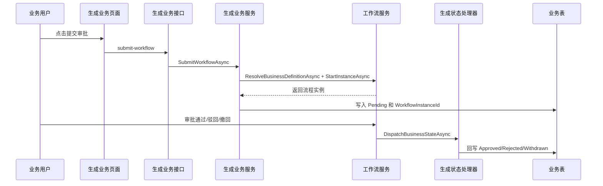

# 代码生成器接入工作流绑定总结文档

## 完成内容

本次完成了代码生成器的审批接入第一版。管理员在代码生成器中开启“审批接入”后，需要填写业务类型编码，生成结果会自动带上审批状态字段、提交审批接口、撤回审批接口、前端审批状态列和操作按钮。

后端生成内容包括：

- 实体增加 `WorkflowInstanceId`、`ApprovalStatus`、业务 Key 创建和解析方法。
- DTO 增加审批状态字段，并生成提交/撤回审批请求对象。
- AppService 注入 `IWorkflowAppService`，通过业务类型解析工作流绑定，再创建或撤回流程实例。
- Repository 增加单条查询和审批状态回写方法。
- Endpoint 增加提交审批、撤回审批接口，并绑定按钮权限。
- MenuSeed 增加提交审批、撤回审批权限种子。
- 建表 SQL 增加 `workflow_instance_id` 和 `approval_status`。
- 启用审批时额外生成 `Generated/{Module}WorkflowStateHandler.cs`，用于审批通过、驳回、撤回后回写业务表状态。

前端生成内容包括：

- 代码生成器配置页增加审批开关和业务类型输入。
- 生成的业务 API 增加 `submitWorkflow`、`withdrawWorkflow` 方法。
- 生成的业务页面增加审批状态列、提交审批、撤回审批、查看流程入口。
- 权限码预览增加 `{permissionPrefix}:submit-workflow` 和 `{permissionPrefix}:withdraw-workflow`。

## 运行机制

`MiniAdminPersistenceServiceCollectionExtensions` 已改为扫描注册 `IWorkflowBusinessStateHandler` 实现。后续代码生成器生成的状态处理器只要编译进 Infrastructure 程序集，就能自动被工作流服务调度，不需要手工修改 DI。

## 使用注意

- 代码生成器只生成审批接入骨架，不自动创建工作流业务绑定。
- 业务类型编码需要和“审批中心/业务绑定”里的 `BusinessType` 一致。
- 生成模块后，管理员需要给角色分配新增的提交审批、撤回审批按钮权限。
- 租户模式下生成的状态处理器会按当前租户过滤业务数据，避免跨租户回写。
- 开发模式下生成前端页面文件时，Vite 可能因为监听到新增文件而自动刷新页面；这不代表生成失败，可在“生成历史”中确认生成记录。

## 修复记录

2026-06-02 生成 `Departments` 且开启审批接入时，后端构建失败：

- 原因：生成的 `DepartmentsAppService` 位于 `MiniAdmin.Application.Departments` 命名空间，模板里的 `Departments.CreateBusinessKey(id)` 会被 C# 优先解析为当前命名空间 `Departments`，而不是领域实体 `MiniAdmin.Domain.Entities.Departments`。
- 修复：审批接入模板改为生成 `global::MiniAdmin.Domain.Entities.{ModuleName}.CreateBusinessKey(id)`，避免模块名、复数命名空间、实体名之间发生解析冲突。
- 同步优化：直接点击“生成”时，如果预览校验未通过，不再继续调用生成接口；生成成功提示补充“前端开发服务可能自动刷新”。

2026-06-02 生成 `mini_departments` 后，后端启动失败：

- 原因：`mini_departments` 已被系统内置 `Department` 实体映射，生成器又生成 `Departments` 实体映射同一张表，EF Core 启动时判定重复表映射。
- 修复：代码生成器预览/生成前会扫描当前 EF 映射表，已被系统或已生成模块映射的表会直接拦截，提示“不能重复生成模块”。
- 清理：删除本次错误生成的 `Departments` 后端、Vben 前端产物；确认菜单树里没有 `/business/departments` 残留。

2026-06-02 后台方式启动 API 时，Windows EventLog 写入权限导致进程退出：

- 原因：直接后台运行 DLL 时 EventLog logger 尝试写入 Windows 系统事件日志，当前权限不足。
- 修复：在默认配置和开发配置中关闭 EventLog provider 输出，保留普通日志，后台启动不再被系统事件日志权限影响。

## 验证结果

- 定向红绿测试：`CodeGeneratorPreview_Includes_Workflow_Binding_When_Enabled|Persistence_Registers_Workflow_State_Handlers_By_Assembly_Scan`，2 通过、0 失败。
- 代码生成器相关测试：`FullyQualifiedName~CodeGenerator`，18 通过、0 失败。
- 后端构建：`dotnet build src/MiniAdmin.Api/MiniAdmin.Api.csproj`，0 警告、0 错误。
- 前端构建：`pnpm run build:antd`，`@vben/web-antd` production build 通过，11 个任务成功。
- 启动验证：后端 `http://localhost:5021/health` 返回 Healthy，前端 `http://localhost:5666` 返回 200。

## 后续建议

- 下一步可以在代码生成器里增加“生成后自动提示业务绑定配置”的引导入口。
- 后续可以支持更细的状态映射，例如业务自定义 `Draft/Pending/Approved/Rejected/Withdrawn` 文案和字典。
- 等生成模块真实安装后，可以补一条端到端示例：生成业务模块、创建业务绑定、提交审批、审批回写业务状态。
