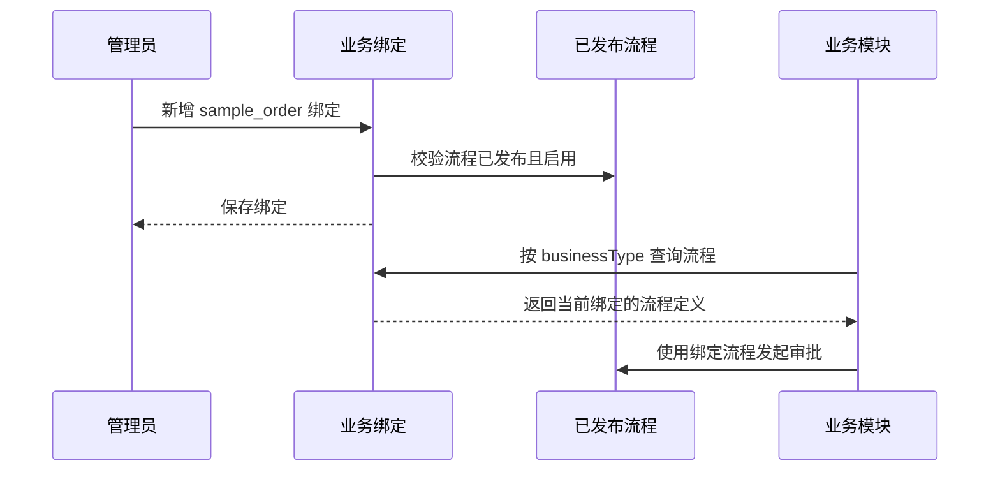

# 工作流业务绑定配置需求文档

## 背景

当前系统已经具备流程定义、发起审批、审批处理、业务单据状态联动和流程版本发布能力。但业务模块接入审批时仍然需要在代码里指定流程定义，后续客户、合同、采购、报销等模块无法统一复用。

企业级后台需要把“业务类型”和“当前可用流程版本”的绑定关系配置化，让业务模块只关心自己的业务类型，由工作流模块负责找到当前绑定的已发布流程。

## 目标

- 增加业务绑定配置，用业务类型绑定一个已发布流程定义。
- 同一个租户下，一个业务类型只能有一条绑定配置。
- 绑定只能选择已发布、启用的流程定义。
- 绑定配置支持启用/停用。
- 审批中心提供可视化配置入口。
- 后端提供根据业务类型查找绑定流程的接口能力，便于后续业务模块和代码生成器复用。

## 业务字段

- `BusinessType`：业务类型编码，例如 `sample_order`、`contract`、`purchase_order`。
- `BusinessName`：业务名称，例如 `示例订单`、`合同审批`。
- `DefinitionId`：绑定的流程定义 ID。
- `IsEnabled`：是否启用绑定。
- `Remark`：说明。

## 验收标准

- 管理员可以在审批中心看到“业务绑定”页签。
- 管理员可以新增、编辑、删除业务绑定。
- 新增/编辑时只能选择已发布流程。
- 同一个业务类型重复绑定会被拒绝。
- 停用绑定后，按业务类型查询时不返回流程定义。
- 已发布新版本后，管理员可以把业务类型切换到新版本。

## 本阶段不做

- 不改代码生成器生成模板。
- 不做表单设计器。
- 不做复杂条件匹配，例如按金额、部门自动选择不同流程。
- 不自动切换到最新流程版本，先由管理员显式选择，避免业务流程静默变化。

## 数据流

