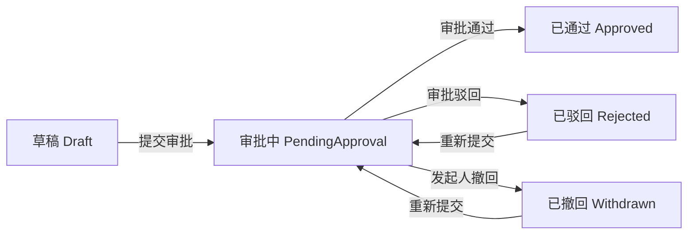

# 工作流业务表单联动需求文档

## 背景

当前系统已经具备流程定义、可视化设计器、发起审批、待办、已办和审批流转能力，但工作流仍主要运行在审批中心内部。企业级后台更常见的场景是业务单据提交后进入审批，审批结果反向驱动业务状态。

本阶段先使用已有的“示例订单”作为示范业务单据，打通业务单据和工作流实例之间的闭环。后续再把这套能力沉淀到代码生成器模板，使生成的业务模块可以选择启用审批能力。

## 目标

- 示例订单支持提交审批。
- 提交审批后，订单进入审批中状态，并记录关联流程实例。
- 审批中心中审批通过后，订单状态变为已通过。
- 审批中心中审批驳回后，订单状态变为已驳回。
- 发起人撤回流程后，订单状态变为已撤回。
- 审批中和已通过的订单不能编辑或删除。
- 前端示例订单列表能看到审批状态，并提供提交审批、撤回审批、查看流程入口。

## 状态流转

## 数据约定

- 示例订单继续使用 `Status` 字段承载业务审批状态。
- 新增 `WorkflowInstanceId` 字段记录当前关联流程实例。
- 工作流 `BusinessKey` 使用 `sample-order:{orderId}` 格式，便于工作流完成后回写业务单据。

## 权限

- 查询、创建、编辑、删除沿用已有示例订单权限。
- 提交审批使用新增权限：`business:sample-order:submit-workflow`。
- 撤回审批使用新增权限：`business:sample-order:withdraw-workflow`。
- 审批动作仍使用已有工作流权限：`workflow:task:approve`。

## 本阶段不做

- 不把所有生成器模板一次性改造成审批模板。
- 不实现复杂业务表单设计器。
- 不实现多流程版本和业务单据历史流程归档。
- 不实现审批通过后的复杂业务动作编排。

## 验收标准

- 新增示例订单默认是草稿。
- 草稿订单可以提交到选中的流程定义。
- 提交后订单状态为审批中，并保存流程实例 ID。
- 审批通过、驳回、撤回后，订单状态自动回写。
- 审批中和已通过订单不能编辑或删除。
- 后端测试覆盖提交、通过、驳回、撤回和状态限制。
