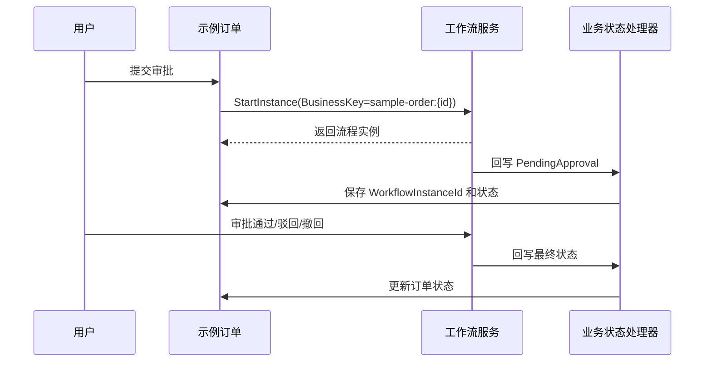

# 工作流业务表单联动任务执行文档

## 任务清单

- [x] 扩展示例订单领域模型，增加审批状态常量和流程实例关联字段。
- [x] 扩展示例订单 DTO、仓储和应用服务，支持提交审批、撤回审批和状态限制。
- [x] 增加工作流业务状态回写处理器，根据 `BusinessKey` 回写示例订单状态。
- [x] 增加示例订单审批权限种子和接口。
- [x] 增加 MySQL 初始化兼容逻辑，确保旧表补齐 `WorkflowInstanceId` 字段。
- [x] 使用 TDD 编写并验证后端业务审批联动测试。
- [x] 调整前端示例订单页面，展示状态、提交审批、撤回和查看流程。
- [x] 运行后端测试、后端构建和前端构建。
- [x] 启动后端和前端，确认接口可用。
- [x] 补充总结文档。

## 后端设计

- `SampleOrder` 增加：
  - `WorkflowInstanceId`
  - 状态常量：`Draft`、`PendingApproval`、`Approved`、`Rejected`、`Withdrawn`
- `ISampleOrderAppService` 增加：
  - `SubmitWorkflowAsync`
  - `WithdrawWorkflowAsync`
- `IWorkflowBusinessStateHandler` 负责业务状态回写。
- `SampleOrderWorkflowStateHandler` 处理 `sample-order:{id}` 业务键。

## 前端设计

- 示例订单列表增加状态 Tag。
- 操作列增加：
  - 草稿、已驳回、已撤回：提交审批。
  - 审批中：撤回审批、查看流程。
  - 已通过：查看流程。
- 提交审批弹窗选择流程定义。

## 数据流

