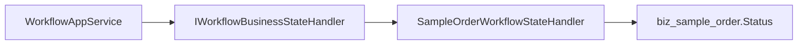

# 工作流业务表单联动总结文档

## 本次完成

本阶段把“示例订单”接入工作流，形成了第一条业务审批闭环：

- 示例订单新增审批状态：
  - `Draft`
  - `PendingApproval`
  - `Approved`
  - `Rejected`
  - `Withdrawn`
- 示例订单新增 `WorkflowInstanceId`，用于关联审批实例。
- 新增 `sample-order:{orderId}` 业务键规范。
- 示例订单支持提交审批和撤回审批。
- 工作流审批通过、驳回、撤回后，会通过业务状态处理器自动回写订单状态。
- 审批中和已通过订单不能编辑或删除。
- 示例订单页面支持状态筛选、状态标签、提交审批、撤回和查看流程入口。

## 核心设计

工作流服务不直接依赖示例订单模块，而是通过 `IWorkflowBusinessStateHandler` 分发业务状态变化。

这让工作流保持通用性：

后续请假单、采购单、合同单可以增加自己的业务处理器，而不需要改工作流核心执行逻辑。

## 重要文件

- `src/MiniAdmin.Domain/Entities/SampleOrder.cs`
- `src/MiniAdmin.Application.Contracts/SampleOrders/SampleOrderDtos.cs`
- `src/MiniAdmin.Application/SampleOrders/SampleOrderAppService.cs`
- `src/MiniAdmin.Application/Workflows/WorkflowAppService.cs`
- `src/MiniAdmin.Infrastructure/Persistence/SampleOrderWorkflowStateHandler.cs`
- `src/MiniAdmin.Api/Generated/SampleOrderEndpoints.cs`
- `frontend/vue-vben-admin/apps/web-antd/src/views/business/sample-order/index.vue`
- `tests/MiniAdmin.Tests/SampleOrderWorkflowBindingTests.cs`

## 验证结果

- `dotnet test ... --filter "FullyQualifiedName~SampleOrderWorkflowBindingTests|FullyQualifiedName~WorkflowAppServiceTests"`：通过，7 个测试。
- `pnpm run build:antd`：通过。
- `dotnet build src/MiniAdmin.Api/MiniAdmin.Api.csproj`：通过，0 警告 0 错误。

## 后续建议

下一阶段可以把“启用审批”沉淀进代码生成器模板：

- 生成业务实体时自动增加 `WorkflowInstanceId` 和审批状态字段。
- 生成提交审批、撤回审批接口。
- 生成前端提交审批弹窗和状态按钮。
- 支持在代码生成器中选择绑定的流程表单名称。
