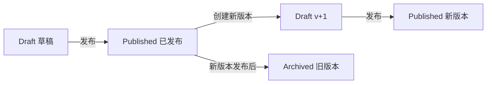

# 工作流定义版本管理与发布需求文档

## 背景

当前工作流定义保存时会直接覆盖定义节点。业务单据已经可以提交审批后，如果管理员继续编辑同一个流程定义，可能影响已经发起或正在审批的流程实例。

企业级工作流需要把“编辑中的流程”和“正在被业务使用的流程版本”隔离开。

## 目标

- 流程定义增加版本号。
- 流程定义增加发布状态：
  - `Draft`：草稿，可以编辑，不可发起审批。
  - `Published`：已发布，可以发起审批。
  - `Archived`：已归档，保留历史实例使用，不可新发起审批。
- 已经产生实例的已发布流程不能直接编辑。
- 管理员可以从已发布流程复制一个新草稿版本。
- 发布新版本时，同编码下旧发布版本自动归档。
- 发起审批时只允许选择已发布、启用且有可用节点的流程版本。

## 状态流转

## 验收标准

- 新建流程默认为草稿版本 `v1`。
- 发布后流程可以用于发起审批。
- 已发布且已有实例的流程再次保存会被拒绝。
- 从已发布流程创建新版本时，复制设计器、节点和基础信息，版本号加一。
- 发布新版本后，旧发布版本变为归档，新提交审批只显示新发布版本。

## 本阶段不做

- 不做复杂版本对比。
- 不做版本回滚。
- 不做每个实例的完整定义快照。
- 不做流程迁移，把旧实例迁移到新版本。
