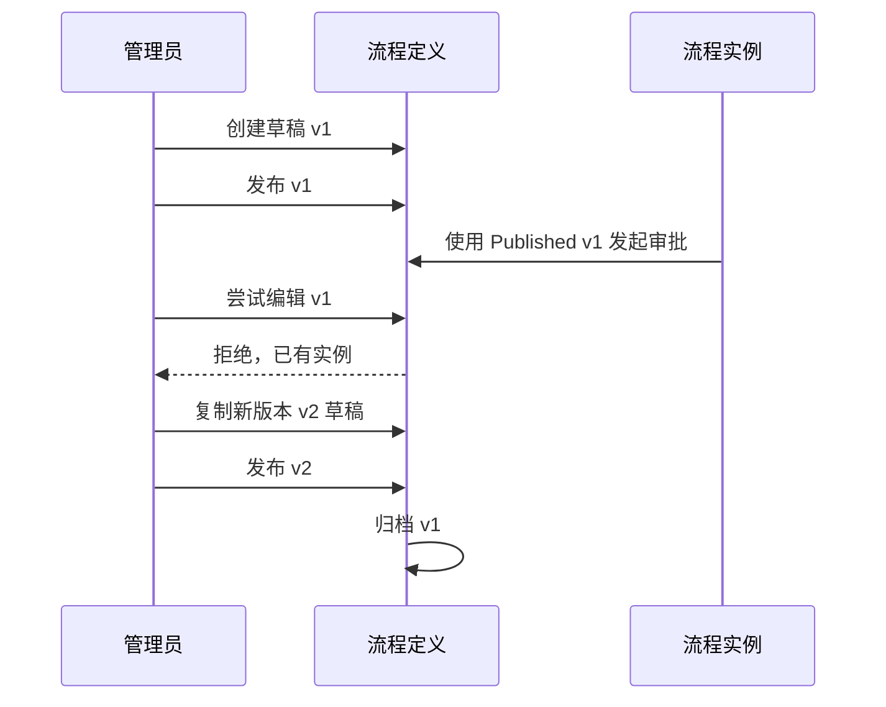

# 工作流定义版本管理与发布任务执行文档

## 任务清单

- [x] 扩展工作流定义领域模型，增加版本号、发布状态、发布时间。
- [x] 扩展 DTO 和应用服务接口，返回版本和发布状态。
- [x] 增加后端测试：已发布且已有实例的流程不能直接编辑。
- [x] 增加后端测试：复制新版本、发布新版本、旧版本归档。
- [x] 实现仓储逻辑：创建草稿、发布、复制新版本、发起审批只取已发布版本。
- [x] 增加 MySQL 初始化兼容逻辑，补齐旧库字段和索引。
- [x] 增加 API：发布流程、新建版本。
- [x] 调整前端审批中心流程定义列表，展示版本/发布状态，增加发布和新版本操作。
- [x] 运行测试、构建并启动前后端。
- [x] 补充总结文档。

## 数据约定

- `Version`：同一流程编码下从 1 开始递增。
- `PublishStatus`：
  - `Draft`
  - `Published`
  - `Archived`
- `PublishedAt`：发布时间。

## 数据流

