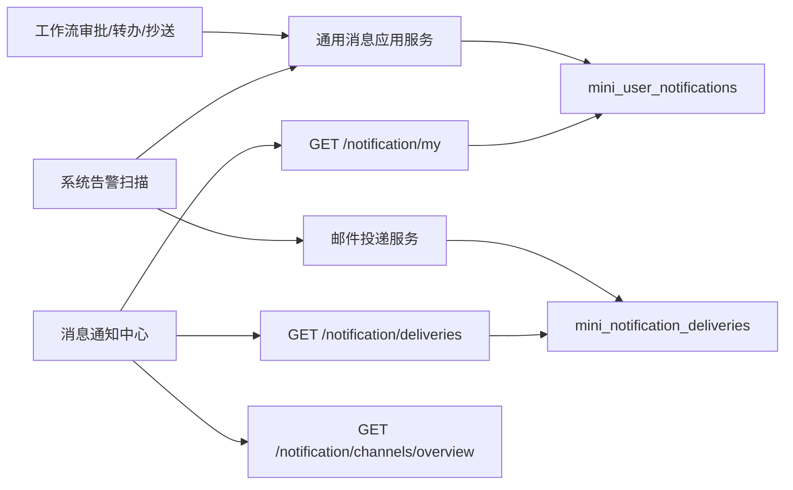

# 消息通知中心需求文档

## 背景

当前系统已经具备几类分散的通知能力：

- 顶部铃铛和 `通知中心` 页面支持个人站内信查看。
- 告警规则已经支持站内信和邮件发送。
- 工作流审批中心已经具备待办、已办、我的申请、我的抄送等能力。
- `mini_notification_deliveries` 已经可以记录邮件投递状态。

但这些能力还没有形成一个统一的企业级“消息通知中心”。管理员无法从一个地方判断消息来自哪里、有没有送达、哪些业务已经接通通知链路；普通用户也无法把工作流提醒和系统告警提醒放在同一个消息工作台里处理。

## 本阶段目标

- 将现有 `通知中心` 升级为 `消息通知中心`。
- 保留当前用户个人消息列表能力，并增强为统一消息入口。
- 将工作流关键动作接入站内信：
  - 发起审批后通知首个审批人
  - 审批通过后通知流程发起人
  - 审批驳回后通知流程发起人
  - 撤回审批后通知当前发起人
  - 转办后通知新的处理人
  - 流程经过抄送节点后通知被抄送人
- 新增消息投递记录查询能力，至少可查看邮件投递记录。
- 在页面中展示通道概览，统一体现站内信、邮件、Webhook 三类通道，其中 Webhook 本阶段先展示规划位，不实现真实发送。

## 范围

- 后端扩展通用站内信创建能力，避免工作流继续使用告警专用接口。
- 后端新增消息投递记录查询接口。
- 后端新增消息通道概览接口。
- 工作流仓储在关键流转节点写入站内信。
- 前端将 `/system/notification` 升级为多页签消息通知中心。
- 前端增加：
  - 概览区
  - 我的消息页签
  - 投递记录页签
  - 通道说明页签

## 不做范围

- 不做 WebSocket / SignalR 实时推送。
- 不做短信、企业微信、钉钉等第三方消息通道。
- 不做 Webhook 实际投递器。
- 不做消息模板设计器。
- 不做跨用户消息代查。
- 不做管理员手工补发失败邮件。

## 数据流

## 权限

- 继续使用 `system:notification:query` 访问消息通知中心页面。
- 工作流通知写入不新增权限，沿用原有工作流业务权限。
- 投递记录不单独新增菜单权限，本阶段并入消息通知中心。

## 验收标准

- 工作流发起后，审批人能在顶部铃铛和消息通知中心看到待办提醒。
- 工作流审批通过、驳回、撤回、转办、抄送后，对应用户可以看到新的站内信。
- `GET /notification/deliveries` 可以按通道、状态、来源类型分页查询投递记录。
- `/system/notification` 页面升级为消息通知中心，至少包含“我的消息”“投递记录”“通道概览”三个区域。
- 邮件配置关闭或未配置时，投递记录仍保留失败或跳过状态，不影响主流程。
