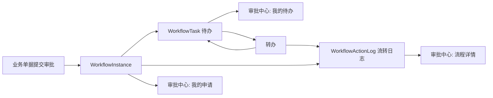

# Workflow Approval Center Closure Requirements

## 背景

当前系统已经具备流程定义、流程发布、业务绑定、流程实例、我的待办和我的已办能力。代码生成器也可以为业务模块生成提交审批、撤回审批和审批状态字段。

但企业后台里的审批中心还需要补齐运行态闭环：发起人要能看自己的申请，抄送人要能看自己的抄送，审批人要能在人员变化时转办待办，流程详情要能稳定呈现业务信息、审批任务和流转轨迹。

## 目标

- 审批中心新增“我的申请”，展示当前用户发起的流程实例。
- 审批中心新增“我的抄送”，展示抄送给当前用户的流程记录。
- 待办任务支持转办给其他可用用户，并记录流转日志。
- 流程详情弹窗展示基础信息、业务标识、当前任务、审批日志和发起内容。
- 后端接口保持租户隔离和当前用户权限边界。
- 前端页面沿用当前后台风格，不重做已有流程设计器。

## 非目标

- 不实现复杂会签、加签、减签、委托代理。
- 不实现独立移动端审批。
- 不在本阶段改造所有已生成业务模块的详情页跳转。
- 不改变现有流程定义画布和节点编辑模型。

## 数据流

