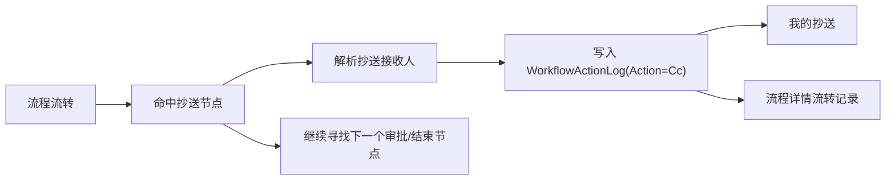

# Workflow CC Node Execution Requirements

## 背景

审批中心已经有“我的抄送”页签和后端查询接口，但流程设计器里的抄送节点仍是设计态节点：它能出现在画布上，却不会保存接收人配置，也不会在流程流转时产生抄送记录。

## 目标

- 抄送节点可以像审批节点一样配置接收人，支持指定用户或指定角色。
- 流程定义保存时持久化节点类型，区分审批节点和抄送节点。
- 流程流转经过抄送节点时，不生成待办任务，而是写入 `Cc` 流转日志。
- 被抄送人可以在“我的抄送”页签看到对应流程。
- 流程详情中能看到抄送节点的流转记录。
- MySQL 启动初始化能自动为 `mini_workflow_nodes` 补齐节点类型列。

## 非目标

- 不新增独立抄送表，本阶段复用 `mini_workflow_action_logs`。
- 不实现抄送已读/未读状态。
- 不实现抄送消息推送，本阶段先完成流程数据闭环。

## 数据流

