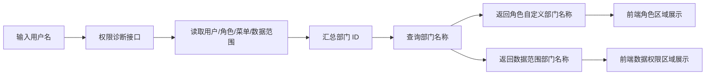

# 数据权限 2.0 诊断增强需求文档

## 背景

数据权限 2.0 第一段已经完成：

- 角色支持 `custom` 自定义部门范围。
- 多角色支持数据范围合并。
- 登录日志、在线用户、安全事件接入了统一数据权限过滤。

但权限诊断页仍有两个明显问题：

1. 数据权限区域只展示部门 ID，不够直观。
2. 角色列表无法直接看出哪些角色配置了自定义部门。

这会让管理员在排查“为什么这个用户能看到这些数据”时，还要再去部门管理和角色管理来回切换。

## 本次目标

- 权限诊断接口返回数据权限对应的部门名称。
- 权限诊断接口返回角色自定义部门对应的部门名称。
- 前端权限诊断页展示“部门名称 + ID”，让组合范围更容易理解。
- 角色区域直接展示自定义部门标签。

## 范围

### 包含

- 后端权限诊断 DTO 扩展。
- 权限诊断仓储补充部门名称解析。
- 权限诊断前端类型更新。
- 权限诊断页展示优化。
- 集成测试覆盖组合范围下的部门名称返回。

### 不包含

- 新增更多数据权限级别。
- 修改现有数据权限过滤规则。
- 对权限诊断页做整页重构。

## 数据流

## 验收标准

- [ ] 组合范围用户查询权限诊断时，可以看到数据范围部门名称。
- [ ] 自定义部门角色在权限诊断角色区能看到对应部门名称。
- [ ] 原有权限诊断接口与构建不报错。
- [ ] 相关测试通过，前端生产构建通过。
