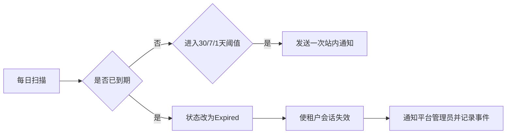

# 租户生命周期闭环分析

## 概述

现有系统会在查询和鉴权时把超过 `ExpireAt` 的启用租户视为过期，但不会主动提醒、持久化过期状态或留下专门的生命周期记录。本功能补齐临期提醒、自动过期、续期恢复和操作历史，形成平台管理员可运营、可追踪的租户生命周期闭环。

## 一、交互链

### 场景 1：平台管理员续期

**用户故事**：作为平台管理员，我想在租户列表为租户续期，以便客户到期后快速恢复使用。

### 场景 2：系统自动提醒和过期

**用户故事**：作为租户管理员，我想在到期前收到提醒，以便及时联系平台管理员；作为平台管理员，我希望到期租户自动停止访问。

## 二、逻辑树

### 事件流

| 时刻 | 事件 | 处理 | 产生的新事件 |
| --- | --- | --- | --- |
| 每日任务 | 扫描启用且 30 天内到期的租户 | 计算当前提醒档位 | 临期提醒或自动过期 |
| 临期提醒 | 首次进入 30/7/1 天档位 | 写入幂等记录并通知租户管理员 | SignalR 未读消息更新 |
| 自动过期 | `ExpireAt <= now` | 状态落库、刷新安全戳、清理授权缓存、下线会话 | 平台管理员通知 |
| 手工续期 | 提交未来到期时间 | 更新到期时间，可选恢复为启用 | 续期历史记录 |

### 状态流转

| 实体 | 触发事件 | 前状态 | 后状态 |
| --- | --- | --- | --- |
| Tenant | 到期扫描 | Active | Expired |
| Tenant | 续期并恢复 | Expired/Disabled | Active |
| Tenant | 仅续期 | Disabled | Disabled |
| TenantLifecycleRecord | 首次进入提醒档位 | 不存在 | 新增且去重键唯一 |

## 三、功能编号与网络定位

| 编号 | 功能节点 | 层级 | 简介 |
| --- | --- | --- | --- |
| D-31 | 租户生命周期记录 | 领域 | 保存创建、变更、提醒、过期和续期轨迹 |
| D-32 | 租户到期扫描 | 领域 | 执行 30/7/1 天提醒和自动过期 |
| P-24 | 租户续期与历史界面 | 前端业务 | 提供续期操作和记录查询 |

## 四、边界

- 复用现有消息中心、SignalR、Scriban 模板、定时任务和会话失效机制。
- 本期不实现订单、支付、自动扣费、邮件短信和复杂续费审批。
- 套餐调整继续使用现有租户编辑能力，不与续期接口耦合。
