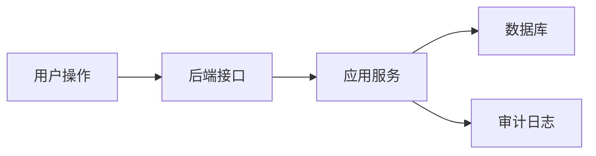

# 功能文档规范

从现在开始，每个较完整的功能都在 `docs/features` 下建立独立目录，目录名使用：

```text
YYYY-MM-DD-feature-name
```

每个功能目录固定包含三份文档：

```text
01-requirements.md
02-tasks.md
03-summary.md
```

## 文档职责

### 01-requirements.md

开工前编写，用来回答“为什么做、做什么、做到什么程度”。

必须包含：

- 背景与目标
- 功能范围
- 不做范围
- 权限与安全要求
- 接口或页面要求
- 数据存储要求
- 验收标准
- 涉及数据流转时，用 Mermaid 图说明

### 02-tasks.md

开发中维护，用来回答“怎么拆、怎么做、怎么验”。

必须包含：

- 任务清单
- 涉及文件
- 执行步骤
- 测试命令
- 当前状态

### 03-summary.md

完成后编写，用来回答“最终做成了什么、以后怎么查”。

必须包含：

- 完成内容
- 关键实现
- 影响范围
- 验证结果
- 使用方式
- 后续建议

## Mermaid 图约定

涉及数据流、权限流、请求链路、状态流转时，优先使用 Mermaid。

示例：



## 后续功能流程

以后每做一个功能，按这个顺序推进：

1. 先创建 `docs/features/YYYY-MM-DD-feature-name/01-requirements.md`
2. 用户确认需求范围
3. 创建并执行 `02-tasks.md`
4. 编码、测试、联调
5. 完成后创建 `03-summary.md`
