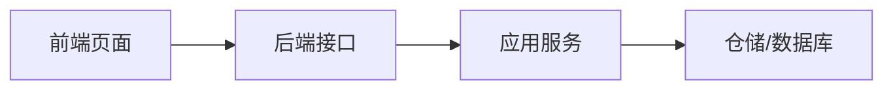

# 功能名称需求文档

## 背景

说明为什么要做这个功能，它解决什么业务或技术问题。

## 目标

- 目标 1
- 目标 2
- 目标 3

## 功能范围

- 包含的能力
- 涉及的页面
- 涉及的接口
- 涉及的数据表或缓存

## 不做范围

- 本阶段暂不实现的内容
- 后续再扩展的内容

## 权限与安全

- 菜单权限
- 按钮权限
- 接口权限
- 数据权限
- 敏感数据处理

## 数据流转

## 验收标准

- [ ] 标准 1
- [ ] 标准 2
- [ ] 标准 3
