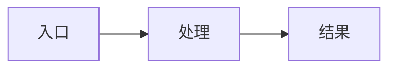

# 功能名称完工总结

## 完成内容

- 内容 1
- 内容 2
- 内容 3

## 关键实现

- 关键点 1
- 关键点 2

## 数据流转



## 影响范围

- 后端
- 前端
- 数据库
- 权限

## 验证结果

```text
填写测试命令与结果
```

## 使用方式

说明用户如何进入页面、如何操作、如何判断结果正确。

## 后续建议

- 建议 1
- 建议 2
