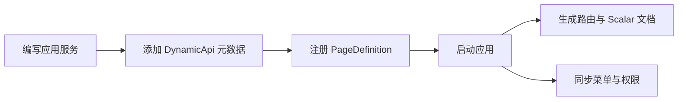

# 平台内核 v1.0 — 功能分析

## 概述

本次重构把分散在 API 扩展类、数据库种子、权限过滤器和各基础设施实现中的平台元数据收敛到统一内核。目标不是增加另一套框架，而是让应用服务、页面、权限、缓存和网关共享同一份声明，并保持现有业务接口可用。

## 一、交互链

### 场景 1：开发者新增业务模块

**用户故事**：作为二开开发者，我想只声明应用服务、页面和权限，以便系统自动生成 API、文档、菜单和授权检查。

### 场景 2：管理员配置访问控制

**用户故事**：作为平台管理员，我想在角色权限之外增加租户、部门、时间和请求属性约束，以便满足细粒度授权要求。

### 场景 3：运维灰度发布与诊断

**用户故事**：作为运维人员，我想按比例、租户、白名单或请求头把流量导向灰度实例，并通过追踪号和熔断状态快速定位问题。

### 场景 4：第三方系统接入

**用户故事**：作为第三方应用开发者，我想通过 OAuth2/OIDC 或个人 AppKey 签名调用 MiniAdmin，以便安全接入用户授权或自动化任务。

## 二、逻辑树

### 事件流

| 时刻 | 事件 | 处理 | 产生的新事件 |
| --- | --- | --- | --- |
| 启动 | 平台模块扫描 | 收集 DynamicApi、PageDefinition 与权限元数据 | 路由表、页面注册表就绪 |
| 请求进入 | 授权请求 | 读取版本化授权快照，先 RBAC 后 ABAC | 授权决策与审计上下文 |
| 数据写入 | 权限/菜单/配置/字典更新 | 失效对应标签版本 | 后续读取重建精准缓存 |
| 网关请求 | 选择目标实例 | 匹配请求头、租户、白名单和稳定哈希比例 | 稳定或灰度代理请求 |
| 通知写入 | 站内通知持久化成功 | SignalR 推送用户组，异步投递邮件/短信 | 投递记录与实时客户端事件 |
| 开放调用 | AppKey 请求 | 校验时间窗、Nonce、HMAC 与作用域 | 外部调用身份或拒绝原因 |

### 状态流转

| 实体 | 触发事件 | 前状态 | 后状态 |
| --- | --- | --- | --- |
| ABAC 策略 | 启用/停用 | Draft/Enabled | Enabled/Disabled |
| 缓存标签 | 写路径失效 | version N | version N+1（新随机版本） |
| 网关断路器 | 连续失败达到阈值 | Closed | Open → HalfOpen → Closed |
| OpenAPI 凭证 | 创建/撤销/到期 | Active | Revoked/Expired |
| 通知投递 | 发送/重试 | Pending/Failed | Succeeded/Failed |

异常流遵循“拒绝优先、旧功能可回退”：授权异常默认拒绝；Redis、SignalR 或外部通知故障不得破坏核心事务；灰度目标不可用时回退稳定目标或由断路器快速失败。

## 三、功能编号与网络定位

| 编号 | 功能节点 | 层级 | 简介 |
| --- | --- | --- | --- |
| I-21 | Dynamic API | 基础设施 | 应用服务声明式暴露与 OpenAPI 文档 |
| I-22 | PageRegistry | 基础设施 | 菜单、路由、组件、权限和国际化单一事实源 |
| I-23 | 授权决策引擎 | 基础设施 | RBAC 快照与 ABAC 条件联合决策 |
| I-24 | 版本化缓存 | 基础设施 | 多租户键空间、标签失效和缓存诊断 |
| I-25 | 网关流量治理 | 基础设施 | 灰度、追踪、限流和熔断 |
| I-26 | 实时消息 | 基础设施 | Scriban 模板、SignalR 通知和聊天 |
| I-27 | 开放平台 | 基础设施 | OAuth2/OIDC 与 HMAC OpenAPI 凭证 |
| I-28 | 平台适配器 | 基础设施 | 服务器监控与多对象存储 |

### 前置依赖

| 依赖节点 | 依赖方式 | 是否已有 |
| --- | --- | --- |
| JWT 身份与租户上下文 | 读取 Claims/CurrentTenant | 是 |
| 菜单与角色仓储 | 查询 RBAC 授权 | 是 |
| Redis 容错缓存 | IDistributedCache | 是 |
| 本地事件总线与工作单元 | 事务后事件 | 是 |
| 通知、工作流、定时任务 | 复用现有领域能力 | 是 |

### 边界接口

| 接口/协议 | 定义方 | 消费方 | 敏感度 |
| --- | --- | --- | --- |
| `IDynamicApiMetadata` | Platform.Core | Platform.AspNetCore | 低 |
| `IPageRegistry` | Platform.Core | 菜单同步、前端路由 | 中 |
| `IAuthorizationDecisionService` | Platform.Core | API、网关、业务服务 | 高 |
| `IPlatformCache` | Platform.Core | 授权、菜单、配置、字典 | 高 |
| OAuth2/OIDC | OpenIddict | 第三方应用 | 高 |
| HMAC OpenAPI | MiniAdmin.Api | 自动化客户端 | 高 |

## 四、结论

- 先完成 I-21 至 I-24，它们是其余能力的共同依赖。
- 存量 Minimal API 不立即删除，先迁移低风险查询接口并用契约测试对比。
- ABAC、开放平台和灰度规则默认关闭，未配置时保持现有行为。
- 生产证书、短信厂商特有参数和云厂商高级存储能力由部署方配置，不进入仓库默认密钥。
