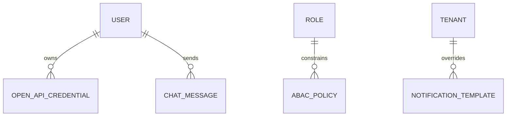
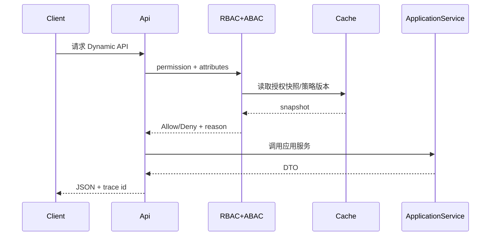

# 平台内核 v1.0 — 服务端设计报告

> 关联设计：[功能分析](../analysis.md) | [执行任务](tasks.md)

## 1. 目标

- 新增可复用的 `MiniAdmin.Platform.Core` 与 `MiniAdmin.Platform.AspNetCore`。
- 应用服务通过 `[DynamicApi]` 与方法元数据自动成为 API，并进入 OpenAPI/Scalar。
- PageRegistry 统一页面、路由、组件、权限码和中英文标题键。
- 现有权限过滤器升级为 RBAC + ABAC 联合决策，并提供可解释结果。
- 授权、菜单、参数、字典使用租户隔离的版本化分布式缓存和精准标签失效。
- 网关支持灰度、追踪、限流和断路器；通知支持 Scriban、SignalR 与聊天。
- 开放平台支持 OAuth2/OIDC 和个人 HMAC OpenAPI 凭证。
- 文件支持 Local、S3、OSS、COS、MinIO；监控覆盖硬件、磁盘、网络和运行时。

## 2. 现状分析

现有项目已经有清晰的领域、应用、基础设施和 API 分层，也已实现 JWT、RBAC、数据范围、Redis 容错缓存、YARP 限流、通知模板、本地/MinIO、定时任务和系统监控。主要问题是元数据分散、端点样板多、权限只做 RBAC、缓存缺少统一标签、网关缺少灰度与熔断、开放平台尚未建立。

## 3. 数据模型与接口

### 数据模型

| 模型 | 关键字段 | 说明 |
| --- | --- | --- |
| `AbacPolicy` | TenantId, SubjectType/Id, Resource, Action, Effect, ConditionsJson, Priority | 拒绝优先的属性策略 |
| `OpenApiCredential` | UserId, AppKey, SecretHash, Scopes, IpAllowList, ExpiresAt, Status | Secret 只在创建时返回 |
| `ChatMessage` | TenantId, SenderId, RecipientId, Content, SentAt, ReadAt | 在线聊天持久记录 |
| `NotificationTemplate` | TenantId(nullable), Code, Channel, templates | 租户模板优先、全局模板回退 |
| `PageDefinition` | Key, ParentKey, Path, Component, Permissions, I18nKey | 代码元数据，不独立建表 |



### 接口契约

| 方法 | 路径 | 用途 |
| --- | --- | --- |
| GET | `/platform/pages` | 查看 PageRegistry 快照 |
| GET/POST/PUT/DELETE | `/platform/abac-policies` | ABAC 策略管理 |
| GET/DELETE | `/platform/cache/keys` | 查询和清理已知缓存键 |
| POST | `/platform/cache/tags/{tag}/invalidate` | 精准失效标签 |
| GET/POST/DELETE | `/open-platform/credentials` | 个人 OpenAPI 凭证管理 |
| GET/POST | `/open-platform/applications` | OAuth 客户端管理 |
| GET | `/system/monitor/details` | 完整服务器信息 |
| Hub | `/hubs/notifications` | 实时通知 |
| Hub | `/hubs/chat` | 在线聊天 |

所有管理接口使用统一授权决策；动态 API 在 OpenAPI 中保留请求/响应模型、标签、权限和操作 ID。

## 4. 核心流程



写路径提交后发布缓存标签失效事件；通知使用保存后拦截器发布 SignalR，外部通道失败只记录投递失败，不回滚业务事务。

## 5. 项目结构与技术决策

```text
src/
|-- MiniAdmin.Platform.Core/          # 无 Web 依赖的元数据与策略契约
|-- MiniAdmin.Platform.AspNetCore/    # Dynamic API、授权过滤、追踪与 Scalar 集成
|-- MiniAdmin.Domain/                 # ABAC、凭证、聊天等领域实体
|-- MiniAdmin.Application/            # 平台用例与存量业务服务
|-- MiniAdmin.Infrastructure/         # EF、缓存、模板、存储和实时事件适配
|-- MiniAdmin.Api/                    # 主应用组装与 Hub
`-- MiniAdmin.Gateway/                # 流量治理
```

| 决策 | 方案 | 理由 |
| --- | --- | --- |
| 总体形态 | 模块化单体 + 可选网关 | 当前规模无需强制分布式事务和服务发现 |
| Dynamic API | MVC ApplicationModel 扫描应用服务 | 获得成熟模型绑定与 OpenAPI，不手写反射绑定器 |
| ABAC | JSON 条件树，拒绝优先 | 可审计、可缓存，避免执行任意表达式 |
| 缓存失效 | 标签版本戳 | 不依赖 Redis SCAN，跨节点成本稳定 |
| OAuth2/OIDC | OpenIddict 7.5.0 | 不自行实现安全协议 |
| 模板 | Scriban 7.2.5 | 安全、成熟，支持租户覆盖 |
| API 文档 | Scalar.AspNetCore 2.16.11 | 直接消费 Microsoft OpenAPI 文档 |
| 对象存储 | 统一 S3 Signature V4 适配器 | 复用现有 MinIO 签名实现，减少 SDK 耦合 |

新增依赖均使用 2026-07-15 查询到的稳定版本，暂不使用预览包。

## 6. 验收标准

| 验收条件 | 验收方式 |
| --- | --- |
| 解决方案完整编译 | `dotnet build MiniAdmin.slnx -c Release` |
| Dynamic API 自动生成并出现在文档 | 访问 `/scalar` 与 `/openapi/v1.json` |
| 旧 API 路由保持通过 | 现有 `MiniAdmin.Tests` 全量测试 |
| RBAC + ABAC 允许、拒绝、通配与租户隔离正确 | 新增授权决策单元测试 |
| 标签失效只影响目标缓存 | 缓存并发与失效测试 |
| 灰度选择可重复且故障可熔断 | Gateway 单元/集成测试 |
| SignalR 用户隔离和聊天历史可用 | Hub 集成测试 |
| OAuth 与 HMAC 重放防护通过 | 开放平台安全测试 |
| Local/S3/OSS/COS/MinIO 基本操作一致 | 存储契约测试 |
| Docker 一键部署仍可用 | `bash deploy.sh` 与健康检查 |

## 7. 暂不实现

| 功能 | 理由 |
| --- | --- |
| 立即拆成多个独立微服务 | 先稳定模块边界，网关已预留后续拆分入口 |
| 自研 OAuth/OIDC 协议栈 | 安全风险高，统一采用 OpenIddict |
| 短信厂商专属管理界面 | v1 提供通道接口与 HTTP 适配，部署方配置具体厂商 |
| 云存储高级能力 | v1 只保证上传、读取、存在检查和删除四个公共操作 |
